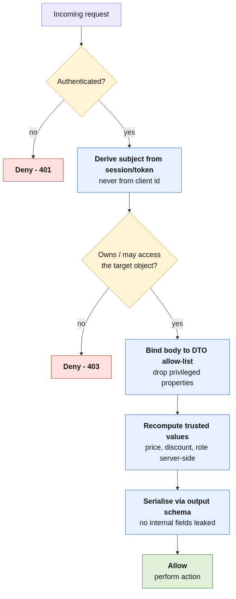

# Broken Access Control & API Authorization

> Enforce authorization on every object and every property, server-side — the #1 web/API risk demands it.

## The Problem

Broken access control is **OWASP A01:2021**, the top web application risk, and underpins three OWASP API
Security Top 10 2023 entries (**API1 BOLA**, **API3 BOPLA / mass assignment**, **API6 sensitive business
flows**). The root cause is almost always the same: the application proves *who you are* (authentication) but
fails to prove *you may act on this specific object, with this specific property* (authorization).

What can go wrong if this isn't enforced:

- **Object-level (IDOR/BOLA):** an endpoint reads an object by a client-supplied id without checking
  ownership. Changing `id=wiener` to `id=carlos` returns another user's account — including their API key. One
  character, full horizontal account takeover.
- **Property-level (BOPLA / mass assignment):** the server binds an entire request body to its internal model,
  so a client can set a property it has no authority over (`chosen_discount.percentage=100`, or the classic
  `isAdmin=true`). Often the response *advertises* the field first ("the GET feeds the POST").
- **Business-logic abuse:** the server trusts a client-supplied value it should own (a `price` sent from the
  browser), so a `$1337` item is bought for `$0.01` — a valid transaction with no malicious characters.

These are *semantic* flaws. Every request is a well-formed HTTP 200, so SAST/DAST/IAST scanners structurally
cannot catch them — they are found by **[manual penetration testing](../../09-Security-Testing/best-practices/access-control-and-api-authorization-testing.md)**
and prevented only by deliberate server-side authorization.

## The Solution

### Overview

Adopt three rules and apply them on **every** request, server-side, deny-by-default:

1. **Derive identity and ownership from the session/token, never from client input.**
2. **Bind request bodies to an explicit allow-list of writable properties (a DTO/schema), never to the domain object.**
3. **Recompute security- and money-relevant values server-side from a trusted source; ignore client copies.**



### Implementation

#### Step 1: Derive the subject server-side (defeats BOLA/IDOR)
Resolve the acting user from the authenticated session, and verify ownership of the requested object before
returning it. Never trust a client-supplied id to select *whose* data to return.

```python
# Resolve the current user from the session; check ownership explicitly.
@app.get("/my-account")
def my_account():
    user = get_user(session.user_id)          # identity from the session, not the request
    return render(user)
```

#### Step 2: Bind to a DTO allow-list (defeats mass assignment / BOPLA)
Accept only the properties a client is permitted to write, via an explicit input schema. Never pass
`request.json` straight into your ORM/model constructor.

```python
class CheckoutDTO(BaseModel):                  # only client-writable fields
    product_id: str
    quantity: int
# privileged fields (discount, price, isAdmin) are simply not part of the DTO
```

#### Step 3: Recompute trusted values (defeats business-logic abuse)
For anything that affects money, entitlements, or security, compute it server-side from a trusted source and
discard whatever the client sent.

```python
price = catalogue.price_of(dto.product_id)     # server owns the price
discount = discount_policy.for_user(session.user)  # not client-supplied
```

#### Step 4: Enforce function- and object-level checks centrally
Use a deny-by-default authorization layer (middleware/policy/decorator) so every endpoint is covered, and an
object-ownership check is impossible to forget. Prefer unpredictable identifiers (UUIDs) as defence-in-depth —
but treat them as defence-in-depth, never as the authorization control itself.

#### Step 5: Don't over-serialise responses
Serialise outputs through an explicit output schema so internal fields (discounts, roles, internal ids) are
never exposed. This closes the "GET feeds the POST" recon path that makes mass assignment trivial.

## Code Examples

### Bad Practice (Vulnerable)

```python
# 1. BOLA: object selected by a client-supplied id, no ownership check.
@app.get("/my-account")
def my_account():
    return render(get_user(request.args["id"]))      # id=carlos returns carlos

# 2. Mass assignment: whole body bound to the model.
@app.post("/api/checkout")
def checkout():
    order = Order(**request.json)                     # client can set chosen_discount
    return order.place()

# 3. Business logic: client price trusted.
def add_to_cart():
    cart.add(product_id, price=request.form["price"]) # price=1 for a $1337 item
```

**Why this is problematic:**
- The `id` is attacker-controlled — any authenticated user reads any account (CWE-639).
- `Order(**request.json)` auto-binds every key, letting a client set privileged properties (CWE-915).
- Trusting a client `price` lets the user dictate what they pay (CWE-602 / CWE-840).

### Good Practice (Secure)

```python
# 1. Identity from the session; ownership enforced.
@app.get("/my-account")
def my_account():
    return render(get_user(session.user_id))

# 2. DTO allow-list; privileged fields can't be bound.
@app.post("/api/checkout")
def checkout(dto: CheckoutDTO):
    price = catalogue.price_of(dto.product_id)        # server owns price
    discount = discount_policy.for_user(session.user) # server owns discount
    return Order(user=session.user, items=dto.items,
                 price=price, discount=discount).place()

# 3. Central deny-by-default authorization.
@require_owns("order_id")
def view_order(order_id): ...
```

**Why this works:**
- The subject and ownership are derived server-side, so there is no client id to tamper with.
- Only allow-listed properties are bound; `chosen_discount`/`isAdmin` are unsettable from the request.
- Money/entitlement values are recomputed from trusted sources, neutralising logic abuse.

## Benefits

- **Closes the top web/API risk** (A01 + API1/API3/API6) at the source.
- **Defence in depth:** central authorization + DTO binding + server-side recomputation each block a distinct sub-class.
- **Testable:** each rule maps to a regression test (see Verification).
- **Maintainable:** explicit schemas and a single authorization layer are easier to review than scattered ad-hoc checks.

## Common Pitfalls

1. **Authentication mistaken for authorization.** A valid session/role does not prove object ownership.
2. **Per-endpoint ad-hoc checks.** Easy to forget one; prefer a central deny-by-default policy.
3. **Relying on unguessable ids.** UUIDs slow enumeration but ids leak — still enforce ownership.
4. **Auto-binding frameworks left at defaults.** Rails/Spring/Django/Pydantic all auto-bind; restrict writable fields explicitly.
5. **Over-serialising responses** with generic `to_json()`/`@JsonAutoDetect`, leaking the fields attackers then write.
6. **Validating only writes.** Excessive data exposure on reads is half of API3.

## When to Apply

- **Always:** any multi-tenant application, any API that exposes object identifiers, anything touching money, roles, or PII.
- **Recommended:** every endpoint that reads or mutates a user- or tenant-scoped object.
- **Consider:** a shared authorization library/policy engine (e.g. OPA, Cedar, framework policies) across services.

## Framework/Language-Specific Guidance

### Python
```python
# Pydantic DTO as the input allow-list; never construct ORM models from request bodies.
class CheckoutDTO(BaseModel):
    product_id: str
    quantity: int = Field(ge=1)
# Django: use explicit ModelForm/serializer `fields`, never `fields = "__all__"`.
```

### JavaScript/Node.js
```javascript
// Pick only allowed keys; never spread req.body into the model.
const { productId, quantity } = req.body;        // allow-list by destructuring
const price = catalogue.priceOf(productId);      // server owns price
// Validate with zod/Joi; serialize responses with an explicit DTO.
```

### Java
```java
// Spring: bind to a request DTO, not the entity; restrict with @JsonView / allowed fields.
// Enforce ownership in a method-security check.
@PreAuthorize("@authz.owns(#orderId, principal)")
public Order getOrder(Long orderId) { ... }
```

## Verification & Testing

### Manual Checks
- Replay every object-scoped request as a *second* user — is access denied?
- Diff documented request fields against accepted fields — can a client set anything privileged?
- For each money/entitlement value, confirm the server recomputes it regardless of the client value.

### Automated Testing
```python
def test_bola_enforced():
    r = user_a().get("/my-account", params={"id": user_b_id})
    assert r.status_code in (401, 403) or user_b_secret not in r.text

def test_mass_assignment_ignored():
    r = user_a().post("/api/checkout", json={"chosen_discount": {"percentage": 100}, **valid_order})
    assert charged_amount(r) == full_price

def test_server_owns_price():
    r = user_a().post("/cart", data={"product_id": "1", "price": "1"})
    assert cart_total(r) == catalogue_price("1")
```

### Security Scanning
Authorization is largely beyond scanner reach. Rely on the regression tests above plus design review; some
tools (Burp Autorize, custom auth-matrix scripts) can flag *missing* object-level checks but won't judge
business logic.

## Related Best Practices

- [Access Control & API Authorization Testing (offense)](../../09-Security-Testing/best-practices/access-control-and-api-authorization-testing.md)
- [Web Application Penetration Testing Methodology](../../09-Security-Testing/best-practices/web-application-penetration-testing-methodology.md)
- [Preventing SSRF & Server-Side Request Abuse](./preventing-ssrf-and-server-side-request-abuse.md)

## Standards & Compliance

- **OWASP Top 10 2021:** A01:2021 Broken Access Control.
- **OWASP API Security Top 10 2023:** API1 BOLA, API3 BOPLA, API5 BFLA, API6 Business Flows.
- **CWE:** CWE-639 (Authorization Bypass Through User-Controlled Key), CWE-915 (Mass Assignment), CWE-285 (Improper Authorization), CWE-602/CWE-840 (Client-Side Enforcement / Business Logic).
- **NIST SP 800-53:** AC-3 (Access Enforcement), AC-6 (Least Privilege).

## Further Reading

- [OWASP Authorization Cheat Sheet](https://cheatsheetseries.owasp.org/cheatsheets/Authorization_Cheat_Sheet.html)
- [OWASP Mass Assignment Cheat Sheet](https://cheatsheetseries.owasp.org/cheatsheets/Mass_Assignment_Cheat_Sheet.html)
- [OWASP API Security Top 10 2023](https://owasp.org/API-Security/editions/2023/en/0x11-t10/)
- [OWASP Top 10: A01:2021 Broken Access Control](https://owasp.org/Top10/A01_2021-Broken_Access_Control/)

## Case Studies

### Incident Example
The reference IDOR lab — `id=wiener`→`id=carlos` returning another user's API key — mirrors numerous real
breaches where authenticated mobile/web APIs allowed any user to enumerate other accounts. The fix is to derive
the subject from the session and verify ownership; no amount of input *validation* would have helped, because
the input was perfectly valid.

### Success Story
Switching checkout from `Order(**request.json)` to a `CheckoutDTO` allow-list plus server-side price/discount
recomputation neutralises both the mass-assignment and business-logic findings at once, and the corresponding
regression tests turn the prior penetration-test findings into permanent guardrails.

## Reference Labs

The vulnerable patterns and fixes above are grounded in these PortSwigger Web Security Academy labs (solved as
part of the contributor's portfolio):

- [User ID controlled by request parameter](https://portswigger.net/web-security/access-control/lab-user-id-controlled-by-request-parameter) — IDOR / BOLA (API1:2023)
- [Excessive trust in client-side controls](https://portswigger.net/web-security/logic-flaws/examples/lab-logic-flaws-excessive-trust-in-client-side-controls) — business-logic abuse (API6:2023)
- [Exploiting a mass assignment vulnerability](https://portswigger.net/web-security/api-testing/lab-exploiting-mass-assignment-vulnerability) — BOPLA / mass assignment (API3:2023)

## Tags

`secure-coding` `access-control` `authorization` `idor` `bola` `bopla` `mass-assignment` `business-logic` `owasp-top-10` `api-security`

---

**Contributed by:** @roldao04
**Last Updated:** 2026-06-17
**Difficulty Level:** Intermediate
**Impact:** High
