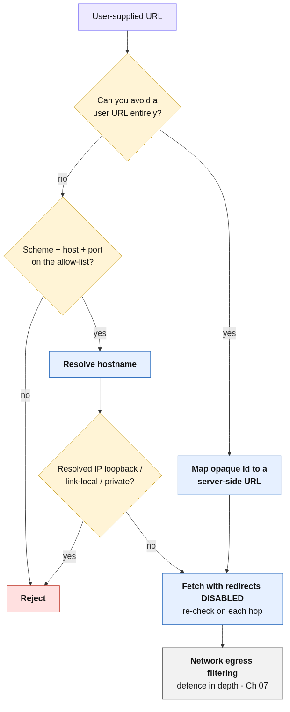

# Preventing SSRF & Server-Side Request Abuse

> Never let user input decide where the server sends a request or what its parsers will fetch — allow-list destinations and disable dangerous parser features.

## The Problem

When an application makes a request, or parses a document, on the client's behalf, the *server's* network
position and filesystem reach become the attacker's. Two related flaws exploit this misplaced trust:

- **Server-Side Request Forgery (SSRF)** — **OWASP A10:2021 / API7:2023, CWE-918.** A feature fetches a URL the
  client supplies. If the destination isn't constrained, an attacker points it at internal-only services. In
  the reference lab, a public "Check stock" button accepted a full `stockApi` URL; setting it to
  `http://localhost/admin/delete?username=carlos` turned an unauthenticated button into a remote control for
  the loopback-only admin panel. *A public endpoint that will fetch a URL for you makes "internal-only" a
  fiction.*
- **XML External Entity (XXE) injection** — **OWASP A05:2021 (was A4:2017), CWE-611.** An XML parser left in its
  insecure default resolves external entities, so attacker-supplied XML can read local files. In the reference
  lab, a `<!DOCTYPE>` defining `<!ENTITY xxe SYSTEM "file:///etc/passwd">` referenced inside `<productId>`
  returned the file's contents in the response.

Both are the same mistake — **the server trusts attacker-controlled input to direct a privileged operation
(an outbound request, a file read)** — and both are server-side, so this entry lives in Secure Coding.

> Note on scope: the *application-layer* defenses below (URL allow-listing, SSRF-safe clients, safe parser
> configuration) are the developer's responsibility. The *network-layer* containment (egress filtering, network
> segmentation, blocking the cloud metadata endpoint) is complementary and is covered by
> **[Container & Cloud Security](../../07-Container-and-Cloud-Security)** — use both, defence in depth.

## The Solution

### Overview

- **For SSRF:** don't let user input determine a request destination. If a URL must be user-supplied, validate
  it against an **allow-list** of permitted hosts/schemes/ports (never a block-list), re-resolve and re-check
  the address to defeat DNS rebinding, and reject loopback / link-local / private ranges. Never treat "the
  request came from localhost" as authentication.
- **For XXE:** disable DTDs and external-entity resolution on every XML parser; prefer simpler formats (JSON)
  where XML isn't required. Because the fix is a parser-construction default, it is well suited to a
  **[SAST](../../03-Static-Analysis-SAST)** rule that fails the build on unsafe parser construction.



### Implementation

#### Step 1 (SSRF): Avoid user-controlled destinations; prefer indirection
If the user only needs to pick *which* internal service, map an opaque identifier to a server-side URL rather
than accepting a URL at all.

```python
STOCK_ENDPOINTS = {"store-1": "https://stock.internal/store/1"}  # no user URL at all
url = STOCK_ENDPOINTS[validated_store_id]
```

#### Step 2 (SSRF): If a URL is unavoidable, allow-list and re-resolve
Validate scheme/host/port against an allow-list, then resolve the hostname and confirm the *resolved IP* is not
loopback/link-local/private — re-checking after resolution defeats DNS-rebinding and redirect tricks.

```python
import ipaddress, socket
ALLOWED_HOSTS = {"stock.internal"}

def safe_fetch_target(url):
    p = urlparse(url)
    if p.scheme not in ("https",) or p.hostname not in ALLOWED_HOSTS:
        raise ValueError("destination not allowed")
    ip = ipaddress.ip_address(socket.gethostbyname(p.hostname))
    if ip.is_loopback or ip.is_link_local or ip.is_private:
        raise ValueError("internal address blocked")
    return url   # fetch with redirects disabled
```

#### Step 3 (SSRF): Disable redirects and never trust source IP for authz
Fetch with redirect-following disabled (a 302 to `http://169.254.169.254/` re-introduces SSRF). And never let
the admin panel treat "came from loopback" as "authorised" — authenticate every request regardless of origin.

#### Step 4 (XXE): Construct parsers with external entities disabled
Turn off DTD processing and external-entity resolution explicitly; do not rely on library defaults.

```python
from defusedxml.ElementTree import fromstring   # safe by default
tree = fromstring(untrusted_xml)                 # DTDs / external entities refused
```

#### Step 5: Validate against a schema and prefer JSON
Where XML is not required, accept JSON. Where XML is required, validate against a strict schema and keep
entity resolution off.

## Code Examples

### Bad Practice (Vulnerable)

```python
# SSRF: the server fetches whatever URL the client sends.
def check_stock():
    return requests.get(request.form["stockApi"]).text   # stockApi=http://localhost/admin

# XXE: parser resolves external entities by default.
import xml.etree.ElementTree as ET
root = ET.fromstring(request.data)                       # <!ENTITY xxe SYSTEM "file:///etc/passwd">
```

**Why this is problematic:**
- The destination is attacker-controlled, so the server reaches internal hosts the firewall blocks externally (CWE-918).
- A default XML parser executes the DTD and reads local files named by external entities (CWE-611).

### Good Practice (Secure)

```python
# SSRF: indirection + allow-list + resolved-IP re-check + no redirects.
def check_stock():
    url = safe_fetch_target(STOCK_ENDPOINTS[validated_store_id])
    return requests.get(url, allow_redirects=False, timeout=5).text

# XXE: a parser that refuses DTDs / external entities.
from defusedxml.ElementTree import fromstring
root = fromstring(request.data)
```

**Why this works:**
- The destination can only be a vetted internal endpoint; the resolved IP is re-checked, so loopback/metadata are unreachable.
- `defusedxml` (or `disallow-doctype-decl` in Java SAX/DOM) removes the external-entity feature entirely — there is no longer a file-read primitive.

## Benefits

- **Removes a pivot into the internal network** (SSRF) and a **local-file-read primitive** (XXE) at the application layer.
- **Allow-listing fails closed** — unknown destinations are denied by default.
- **SAST-friendly:** unsafe parser construction and user-controlled request destinations are detectable patterns.
- **Composable with network egress controls** for true defence in depth.

## Common Pitfalls

1. **Block-lists instead of allow-lists.** Attackers bypass block-lists with octal/hex IPs, `0.0.0.0`, IPv6, DNS rebinding, and redirects.
2. **Validating the URL string but not the resolved IP.** DNS rebinding changes the answer between check and fetch — re-resolve and re-check, or pin the IP.
3. **Following redirects.** A permitted host can 302 you to `169.254.169.254` (cloud metadata).
4. **Trusting source IP / loopback as authentication** for internal panels.
5. **Disabling only DTDs but leaving parameter entities / `XInclude` enabled.**
6. **Assuming "XML is just data."** A DTD is *instructions the parser executes*.

## When to Apply

- **Always:** any feature that fetches a user-supplied URL (webhooks, link previews, PDF/HTML renderers, "import from URL", stock/price lookups) and any endpoint that parses XML/SVG/DOCX/SOAP.
- **Recommended:** review every outbound HTTP client and every XML/markup parser for safe construction.
- **Consider:** a central "safe fetch" helper and a single hardened parser factory reused across the codebase.

## Framework/Language-Specific Guidance

### Python
```python
# XXE: use defusedxml instead of the stdlib parsers for untrusted input.
from defusedxml.ElementTree import fromstring
# SSRF: wrap requests in a helper that allow-lists hosts and re-checks resolved IPs.
```

### JavaScript/Node.js
```javascript
// SSRF: validate with the WHATWG URL parser, allow-list host+protocol, block private ranges,
// and set maxRedirects: 0. XXE: most JSON-first stacks avoid XML; if parsing XML, disable
// entity expansion (e.g. libxmljs `noent: false`, fast-xml-parser without entity processing).
```

### Java
```java
// XXE: harden the factory explicitly.
DocumentBuilderFactory f = DocumentBuilderFactory.newInstance();
f.setFeature("http://apache.org/xml/features/disallow-doctype-decl", true);
f.setExpandEntityReferences(false);
// SSRF: validate destination + disable redirects (HttpClient.Redirect.NEVER).
```

## Verification & Testing

### Manual Checks
- Try to point any URL parameter at `http://localhost/`, `http://127.0.0.1/`, `http://169.254.169.254/` and private ranges — all rejected?
- Confirm redirects are not followed and that resolved IPs are re-checked.
- Submit XML with an external entity (`file:///etc/hostname`) — is it refused, with no file content echoed?

### Automated Testing
```python
def test_ssrf_blocks_internal():
    for bad in ["http://localhost/admin", "http://169.254.169.254/", "http://127.0.0.1/"]:
        assert post("/product/stock", data={"stockApi": bad}).status_code in (400, 403)

def test_xxe_disabled():
    xxe = ('<?xml version="1.0"?><!DOCTYPE f [<!ENTITY x SYSTEM "file:///etc/passwd">]>'
           '<stockCheck><productId>&x;</productId></stockCheck>')
    r = post("/product/stock", data=xxe)
    assert "root:x:0:0" not in r.text
```

### Security Scanning
- **[SAST](../../03-Static-Analysis-SAST)**: rules for unsafe XML parser construction and user-controlled request destinations.
- **DAST / Burp Collaborator**: out-of-band detection for blind SSRF/XXE.

## Related Best Practices

- [Web Application Penetration Testing Methodology](../../09-Security-Testing/best-practices/web-application-penetration-testing-methodology.md)
- [Broken Access Control & API Authorization](./broken-access-control-and-api-authorization.md)
- [Container & Cloud Security](../../07-Container-and-Cloud-Security) — network egress filtering and metadata-endpoint lockdown (defence in depth).

## Standards & Compliance

- **OWASP Top 10 2021:** A10:2021 SSRF; A05:2021 Security Misconfiguration (XXE).
- **OWASP API Security Top 10 2023:** API7:2023 SSRF.
- **CWE:** CWE-918 (SSRF), CWE-611 (Improper Restriction of XML External Entity Reference).
- **NIST SP 800-53:** SC-7 (Boundary Protection).

## Further Reading

- [OWASP SSRF Prevention Cheat Sheet](https://cheatsheetseries.owasp.org/cheatsheets/Server_Side_Request_Forgery_Prevention_Cheat_Sheet.html)
- [OWASP XXE Prevention Cheat Sheet](https://cheatsheetseries.owasp.org/cheatsheets/XML_External_Entity_Prevention_Cheat_Sheet.html)
- [PortSwigger: SSRF](https://portswigger.net/web-security/ssrf) · [XXE](https://portswigger.net/web-security/xxe)
- [defusedxml](https://pypi.org/project/defusedxml/)

## Case Studies

### Incident Example
SSRF against the cloud metadata endpoint (`169.254.169.254`) has driven major breaches by letting attackers
steal instance IAM credentials — the reference lab's loopback admin panel is the same shape: the server's
network position is worth more than any credential. Allow-listing destinations and re-checking resolved IPs
closes it; egress filtering contains what slips through.

### Success Story
Replacing stdlib XML parsing with `defusedxml` (or hardening the Java factory) eliminates an entire bug class
in a single, SAST-enforceable change — the file-read primitive simply ceases to exist, and the regression test
that once disclosed `/etc/passwd` now returns nothing.

## Reference Labs

The SSRF and XXE patterns above are grounded in these PortSwigger Web Security Academy labs (solved as part of
the contributor's portfolio):

- [Basic SSRF against the local server](https://portswigger.net/web-security/ssrf/lab-basic-ssrf-against-localhost) — SSRF reaching a loopback-only admin panel (API7:2023 / A10:2021)
- [Exploiting XXE using external entities to retrieve files](https://portswigger.net/web-security/xxe/lab-exploiting-xxe-to-retrieve-files) — XXE file disclosure via an insecure XML-parser default (A05:2021)

## Tags

`secure-coding` `ssrf` `xxe` `server-side-request-forgery` `xml-external-entity` `allow-list` `input-validation` `owasp-top-10`

---

**Contributed by:** @roldao04
**Last Updated:** 2026-06-17
**Difficulty Level:** Intermediate
**Impact:** High
