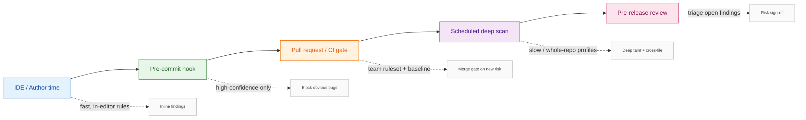
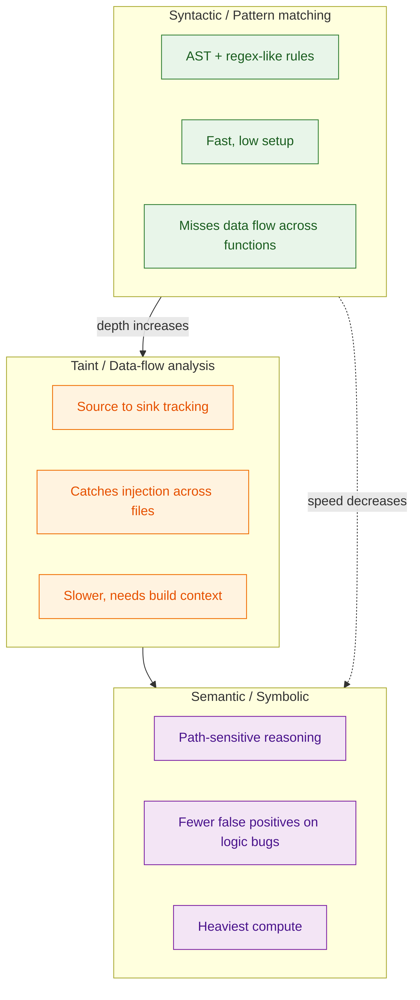
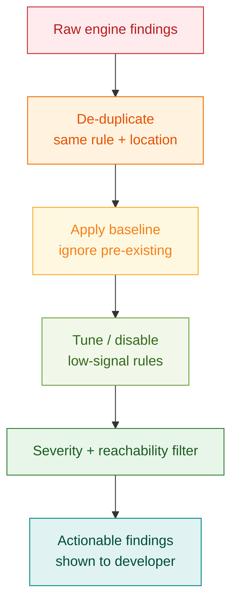
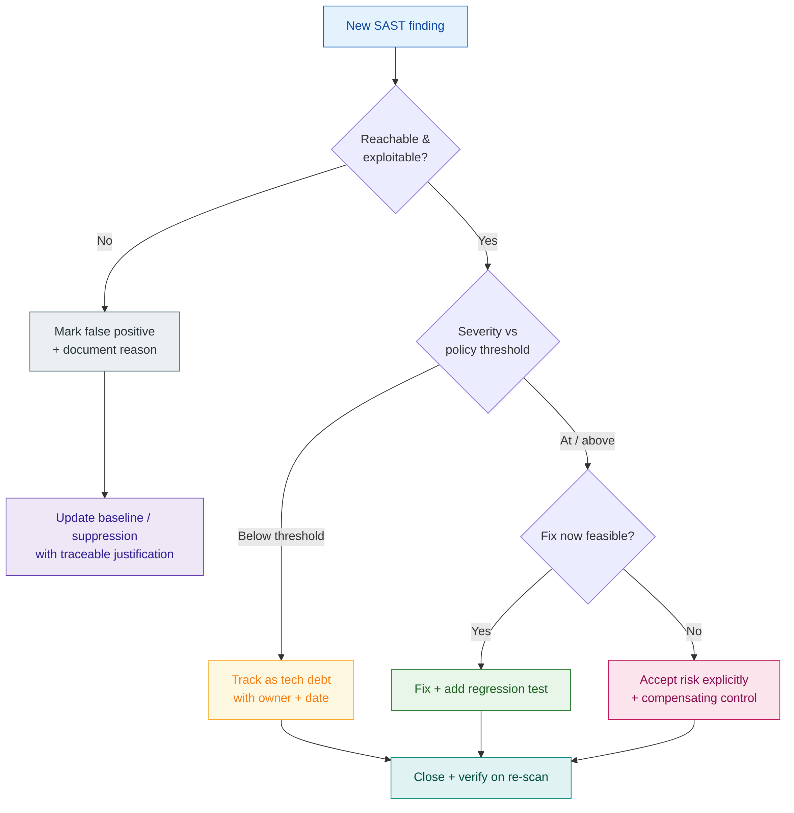

# Static Analysis (SAST) Blueprint

> A practical guide to making Static Application Security Testing useful: choosing the right engine, placing it at the right stage, and keeping the signal-to-noise ratio high enough that developers actually act on findings.

## The Problem

Static Application Security Testing (SAST) scans source code, bytecode, or binaries **without executing them** to find security weaknesses early, while they are cheapest to fix. The promise is compelling: catch SQL injection, hardcoded secrets, path traversal, and unsafe deserialization before they ever reach production.

In practice, most SAST rollouts fail for predictable reasons:

- **Noise drowns signal.** A first scan of a real codebase often returns thousands of findings. Without baselining and tuning, developers learn to ignore the tool entirely. This is the single most common cause of SAST abandonment.
- **It runs in the wrong place.** Heavyweight whole-repository taint analysis on every push slows delivery; conversely, only scanning at release time means findings arrive too late to fix cheaply.
- **No ownership of findings.** Results pile up in a dashboard nobody triages. "Accepted risk" becomes "silently ignored."
- **The wrong engine for the job.** A fast pattern matcher is great for catching `eval(user_input)`, but it cannot trace tainted data across files the way a data-flow engine can. Teams pick one and assume it covers everything.
- **False sense of completeness.** SAST cannot see runtime configuration, environment-specific behavior, or business-logic flaws. Treating a clean SAST report as "secure" is a classic mistake.

The core insight: **SAST is not a scanner you bolt on — it is a feedback system.** Its value depends entirely on where it runs, how its output is filtered, and whether findings are owned and resolved.

## The Solution

### Overview

This blueprint treats SAST as a layered control, mirroring the staged approach used across the delivery lifecycle: fast, high-confidence checks run early and close to the developer; deeper, slower analysis runs later where longer execution and full build context are acceptable.



The guiding rule mirrors the broader DevSecOps principle of *fast feedback, deeper validation later*:

- **IDE / author time** — instant, in-editor rules so issues are fixed before they are even committed.
- **Pre-commit** — a small set of high-confidence rules that block obvious mistakes locally in seconds.
- **Pull request / CI** — the team's approved ruleset with a baseline, acting as the merge gate on *newly introduced* risk.
- **Scheduled deep scan** — slow, whole-repository taint and cross-file profiles that are too expensive for every PR.
- **Pre-release** — human triage of remaining findings before sign-off.

### Understand the Engine Types Before You Choose a Tool

Not all SAST is the same. Tool selection should follow from what kind of analysis you actually need.



| Engine type | How it works | Strengths | Limitations | Example tools |
| --- | --- | --- | --- | --- |
| **Syntactic / pattern** | Matches rules against the abstract syntax tree (AST) | Fast, low setup, easy custom rules | Misses data flow across functions/files | Semgrep (OSS rules), Bandit, ESLint security plugins |
| **Taint / data-flow** | Tracks untrusted data from **source** to **sink** | Catches injection across files; far fewer false positives on flow bugs | Slower; often needs build/compile context | CodeQL, Semgrep Pro, Checkmarx, Fortify |
| **Semantic / symbolic** | Path-sensitive reasoning over program states | Detects logic and path-dependent bugs with high precision | Heaviest compute; longest scans | CodeQL, commercial engines |

Practical guidance:

- Start with a **pattern engine** for breadth and speed — it gives immediate value in pre-commit and PR stages.
- Add a **taint/data-flow engine** for the vulnerability classes that matter most (injection, SSRF, deserialization) on a schedule or in deeper CI jobs.
- Don't pay for semantic depth you won't triage. Depth is only valuable if someone acts on the findings.

### Core Principle: Tune for Signal, Not Coverage

A SAST tool that reports everything reports nothing. The objective is a small stream of **actionable** findings, not a large pile of theoretical ones.



Every finding should pass through this funnel before it reaches a developer:

1. **De-duplicate** — collapse the same rule firing at the same location.
2. **Baseline** — on first adoption, snapshot existing findings and *only fail on new ones*. This is what makes SAST adoptable on a legacy codebase.
3. **Tune rules** — disable or downgrade low-signal rules for your stack; promote the high-value ones to blocking.
4. **Filter by severity and reachability** — a high-severity finding in dead/unreachable code is lower priority than a medium one on a request path.

## Implementation

### Step 1: Start in the IDE and Pre-commit, Not the Pipeline

The earliest feedback is the cheapest. Give developers in-editor analysis and a thin pre-commit hook with only **high-confidence** rules.

```yaml
# .pre-commit-config.yaml — fast, deterministic, local
repos:
  - repo: https://github.com/semgrep/pre-commit
    rev: v1.117.0
    hooks:
      - id: semgrep
        args: ["--config", "p/ci", "--error", "--quiet"]
  - repo: https://github.com/PyCQA/bandit
    rev: "1.7.10"
    hooks:
      - id: bandit
        args: ["-ll"]   # only report medium+ confidence and severity
```

What belongs here: high-confidence rules only (dangerous functions, obvious injection, hardcoded secrets).
What does **not** belong here: slow whole-repo taint scans or noisy rules developers cannot resolve in seconds.

### Step 2: Make the Pull Request the Main Enforcement Gate

The PR is where the team decides what to merge, so it is the right place for the **team-approved ruleset plus a baseline**. Block only on high-confidence, high-severity, newly introduced issues.

```yaml
# .github/workflows/sast.yml
name: sast
on:
  pull_request:
  schedule:
    - cron: "0 2 * * *"   # nightly deep scan

jobs:
  pr-sast:
    if: github.event_name == 'pull_request'
    runs-on: ubuntu-latest
    permissions:
      contents: read
      security-events: write   # upload SARIF to code scanning
    steps:
      - uses: actions/checkout@v4
      - name: Semgrep PR gate (diff-aware, baseline)
        run: semgrep ci --config auto --sarif --output semgrep.sarif
        env:
          SEMGREP_BASELINE_REF: ${{ github.event.pull_request.base.ref }}
      - name: Upload findings
        uses: github/codeql-action/upload-sarif@v3
        with:
          sarif_file: semgrep.sarif
```

Key choices:

- **Diff-aware / baseline scanning** (`SEMGREP_BASELINE_REF`) means the PR fails only on risk *this change introduces* — the single most important setting for developer trust.
- **SARIF output** is the lingua franca of SAST. Emitting SARIF lets findings render inline in the PR (GitHub/GitLab code scanning) and feed any triage system.
- Block on high severity; surface medium as warnings for human triage.

### Step 3: Push Deep Analysis to a Schedule

Data-flow and semantic engines that need the full repository and build context belong in nightly jobs, not on every push.

```yaml
  deep-sast:
    if: github.event_name == 'schedule'
    runs-on: ubuntu-latest
    permissions:
      security-events: write
    steps:
      - uses: actions/checkout@v4
      - uses: github/codeql-action/init@v3
        with:
          languages: javascript-typescript, python
          queries: security-extended   # deeper query suite
      - uses: github/codeql-action/analyze@v3
```

This is where cross-file taint tracking, `security-extended` query packs, and whole-repo profiles earn their cost without slowing the merge path.

### Step 4: Triage Every Finding Deliberately

A finding is not "done" when it appears — it is done when it is fixed, accepted with a reason, or proven false with a documented justification.



- **Reachable & exploitable? No →** mark false positive **and record why** (so the suppression is auditable).
- **Below policy threshold →** track as security tech debt with an owner and a date.
- **At/above threshold, fixable now →** fix and add a regression test so it cannot silently return.
- **Cannot fix now →** accept risk explicitly with a compensating control, never silently.

### Step 5: Suppress Findings Honestly

Suppressions are necessary but dangerous — they are how real bugs get hidden. Require that every suppression is **local, narrow, and justified**.

```python
# Good: narrow, inline, justified, references the triage decision
import subprocess
# nosec B603 - args are a fixed allowlist, no user input reaches this call (JIRA SEC-412)
subprocess.run(["/usr/bin/git", "status"], check=True)
```

```python
# Bad: blanket file-level disable hides everything, forever, with no reason
# bandit: skip-file
```

Prefer baselines (which track *known* findings as data) over scattered inline ignores wherever possible, so the suppression set is reviewable in one place.

## Code Examples

### Bad Practice (Vulnerable)

```python
# Classic taint flow a data-flow SAST engine will flag:
# SOURCE (user input) ---> SINK (SQL query) with no sanitization
from flask import request
import sqlite3

def get_user():
    user_id = request.args.get("id")              # SOURCE: untrusted input
    conn = sqlite3.connect("app.db")
    query = "SELECT * FROM users WHERE id = '" + user_id + "'"  # SINK
    return conn.execute(query).fetchall()         # CWE-89: SQL Injection
```

**Why this is problematic:**

- User-controlled `user_id` flows directly into a string-concatenated query (the source-to-sink path).
- An attacker can pass `id=1' OR '1'='1` to dump the table, or stack a destructive statement.
- A pattern-only scanner might miss it if the concatenation is split across functions; a **taint engine** follows the flow and flags it.

### Good Practice (Secure)

```python
from flask import request
import sqlite3

def get_user():
    user_id = request.args.get("id", type=int)    # validate/coerce at the boundary
    conn = sqlite3.connect("app.db")
    query = "SELECT * FROM users WHERE id = ?"     # parameterized — data, not code
    return conn.execute(query, (user_id,)).fetchall()
```

**Why this works:**

- The query is **parameterized**, so user input can never be interpreted as SQL.
- Input is coerced to `int` at the trust boundary, breaking the taint path the analyzer tracks.
- A re-scan confirms the source-to-sink flow no longer reaches a dangerous sink — which is exactly why fixes should be verified on the next scan.

## Benefits

- **Cheaper fixes** — defects caught at author/PR time cost a fraction of those found in production.
- **High developer trust** — baselining and diff-aware gating mean developers see only what their change introduced.
- **Auditable risk decisions** — every finding is fixed, tracked, or suppressed with a recorded reason.
- **Defense in depth** — pairs naturally with SCA (dependencies), DAST (runtime), and secret scanning to cover what SAST cannot see.

## Common Pitfalls

1. **Turning on every rule at once.** Start narrow and high-confidence; expand as trust grows.
2. **No baseline on legacy code.** Without it, the first scan buries the team and the tool gets disabled.
3. **Blocking on medium/low findings.** Reserve merge-blocking for high-confidence, high-severity issues.
4. **Blanket file-level suppressions.** They hide future real bugs; require narrow, justified inline ignores.
5. **Treating a clean SAST report as "secure."** SAST cannot see runtime config, auth logic, or business-logic flaws.
6. **Ignoring SARIF.** Without machine-readable output, triage and de-duplication become manual and unsustainable.
7. **Running deep taint analysis on every push.** It slows delivery; schedule it instead.

## When to Apply

- **Always:** For any codebase that handles real users, data, or external input. SAST in the PR gate should be table stakes.
- **Recommended:** When introducing security tooling for the first time — SAST gives the fastest, most concrete early wins.
- **Consider:** For prototypes and student projects, a lightweight pattern scanner in CI (e.g. `semgrep ci --config auto`) is enough to build good habits without heavy setup.

## Framework/Language-Specific Guidance

### Python
```bash
# Bandit for Python-specific weaknesses; Semgrep for cross-language coverage
bandit -r ./src -ll -f sarif -o bandit.sarif
semgrep --config p/python --sarif -o semgrep.sarif ./src
```

### JavaScript / TypeScript / Node.js
```bash
# Semgrep's JS/TS rules + CodeQL for deeper data-flow on a schedule
semgrep --config p/javascript --config p/typescript --sarif -o semgrep.sarif .
```

### Java
```bash
# Semgrep for fast PR checks; CodeQL or a commercial engine for deep taint analysis
semgrep --config p/java --sarif -o semgrep.sarif .
```

### Go
```bash
# gosec is the de facto Go SAST; complements Semgrep's p/golang ruleset
gosec -fmt sarif -out gosec.sarif ./...
```

## Verification & Testing

### Manual Checks
- Confirm the PR gate is **diff-aware/baselined** and blocks only on new high-severity findings.
- Confirm every suppression is narrow, inline, and carries a documented reason or ticket reference.
- Confirm deep/taint analysis runs on a schedule, not on every push.
- Confirm SAST output is exported as SARIF and rendered where developers work.

### Automated Testing
```yaml
- name: Enforce SAST gate
  run: |
    semgrep ci --config auto --sarif --output semgrep.sarif
    test ! -s <(jq '.runs[].results[] | select(.level=="error")' semgrep.sarif) \
      || (echo "Blocking SAST findings present" && exit 1)
```

### Security Scanning
- **Pattern SAST:** Semgrep, Bandit (Python), gosec (Go), ESLint security plugins (JS/TS).
- **Data-flow / semantic SAST:** CodeQL, Semgrep Pro, Checkmarx, Fortify, Snyk Code.
- **Quality + SAST platform:** SonarQube / SonarCloud for combined code quality and security hotspots.

### Metrics That Actually Matter

Avoid vanity metrics like total finding count. Prefer outcome metrics:

- mean time to remediate high-severity findings;
- percentage of PRs that introduce zero new high-severity findings;
- false-positive rate of blocking rules (drives rule tuning);
- suppression count and how many carry a documented justification;
- rule/language coverage versus the languages actually in the repo.

## Related Best Practices

- [Secure Coding](../../02-Secure-Coding/best-practices) — SAST enforces, at scale, the patterns that secure coding standards define.
- [Dependency and Supply Chain Security (SCA)](../../04-Dependency-and-Supply-Chain-Security/best-practices) — SAST covers first-party code; SCA covers third-party dependencies. Use both.
- [Secrets Management](../../05-Secrets-Management/best-practices) — secret scanning is the highest-value pre-commit SAST-adjacent check.
- [Dynamic Analysis (DAST)](../../06-Dynamic-Analysis-DAST/best-practices) — DAST validates at runtime what SAST cannot see statically.
- [CI/CD Pipeline Security](../../08-CI-CD-Pipeline-Security/best-practices/devsecops-pipeline-blueprint.md) — this blueprint is the SAST detail layer behind that pipeline's PR and scheduled stages.

## Standards & Compliance

- **OWASP Top 10:** Directly supports A03:2021 (Injection), A01 (Broken Access Control patterns), A08 (Software/Data Integrity), and others by detecting weakness patterns in code.
- **CWE:** Maps to detectable weakness classes such as CWE-89 (SQL Injection), CWE-79 (XSS), CWE-78 (OS Command Injection), CWE-22 (Path Traversal), CWE-502 (Unsafe Deserialization), CWE-798 (Hardcoded Credentials).
- **OWASP ASVS:** SAST is an evidence source for several verification requirements (input handling, injection defenses).
- **NIST SSDF (SP 800-218):** Aligns with practice PW.7/PW.8 (review and analyze code to identify vulnerabilities).
- **PCI DSS:** Requirement 6 calls for addressing common coding vulnerabilities and reviewing code — SAST is a standard control.

## Further Reading

- [OWASP Source Code Analysis Tools](https://owasp.org/www-community/Source_Code_Analysis_Tools)
- [OWASP DevSecOps Guideline — Static Application Security Testing](https://owasp.org/www-project-devsecops-guideline/latest/)
- [NIST SSDF (SP 800-218)](https://csrc.nist.gov/pubs/sp/800/218/final)
- [SARIF Specification (OASIS)](https://docs.oasis-open.org/sarif/sarif/v2.1.0/sarif-v2.1.0.html)
- [Semgrep Documentation](https://semgrep.dev/docs/)
- [CodeQL Documentation](https://codeql.github.com/docs/)
- [CWE Top 25 Most Dangerous Software Weaknesses](https://cwe.mitre.org/top25/)

## Case Studies

### Incident Example

Many high-impact injection and deserialization breaches stem from a tainted-input-to-dangerous-sink flow that a properly configured data-flow SAST engine can detect before release. The recurring lesson is not that the bug was undetectable — it is that either no static analysis ran on the affected path, or its findings were lost in unfiltered noise and never triaged.

### Success Story

Teams that introduce SAST with a **baseline first** (fail only on new findings) and a **diff-aware PR gate** consistently report higher adoption than teams that switch everything on at once. Developers trust a tool that only flags what their change introduced, and the security team still gets full-depth coverage from scheduled deep scans.

## Acronym Glossary

| Acronym | Meaning |
| --- | --- |
| AST | Abstract Syntax Tree |
| CI/CD | Continuous Integration / Continuous Delivery |
| CWE | Common Weakness Enumeration |
| DAST | Dynamic Application Security Testing |
| IDE | Integrated Development Environment |
| OSS | Open Source Software |
| PR | Pull Request |
| SARIF | Static Analysis Results Interchange Format |
| SAST | Static Application Security Testing |
| SCA | Software Composition Analysis |
| SDLC | Software Development Life Cycle |
| SSDF | Secure Software Development Framework |
| SSRF | Server-Side Request Forgery |
| XSS | Cross-Site Scripting |

## Tags

`sast` `static-analysis` `code-scanning` `taint-analysis` `semgrep` `codeql` `devsecops` `shift-left`

---

**Contributed by:** @ruimachado23
**Last Updated:** 2026-06-10
**Difficulty Level:** Intermediate
**Impact:** High
