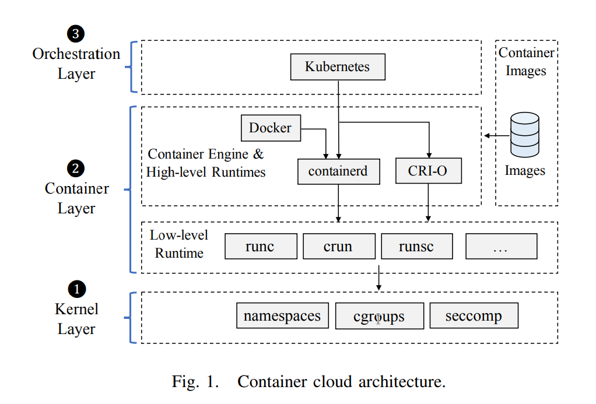
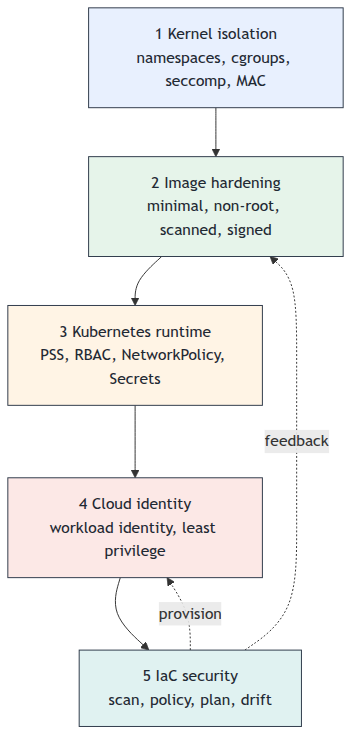
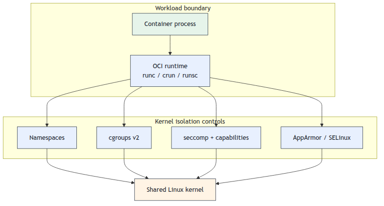
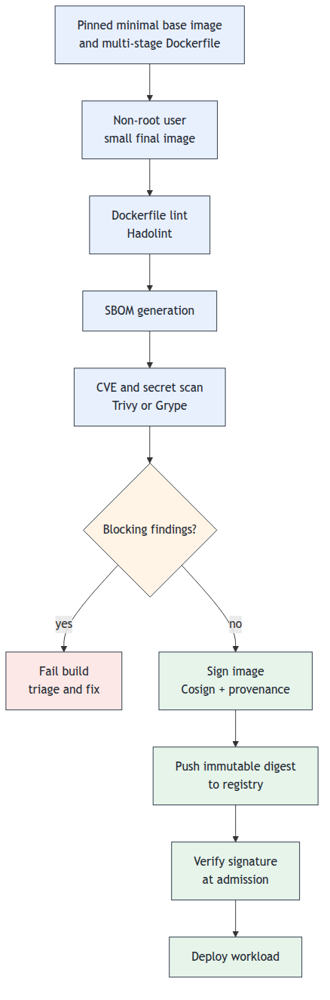
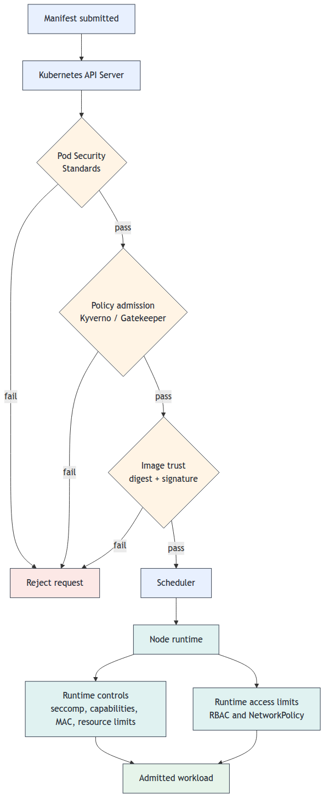
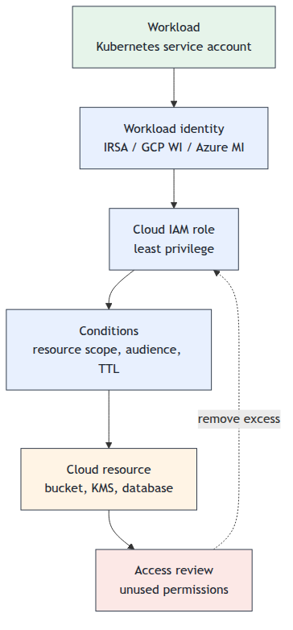
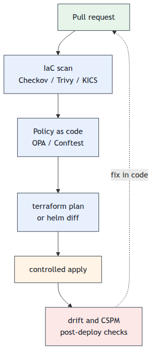

# Container and Cloud Security Blueprint

> A layered approach to securing container images, Kubernetes workloads, cloud identities, and infrastructure definitions across the delivery lifecycle.

## Introduction

Container technologies have fundamentally changed how software is built, deployed, and operated. By packaging applications and their dependencies into portable units that share the host operating system kernel, containers achieve a level of resource efficiency and deployment speed that traditional virtual machines cannot match. Technologies such as Docker, containerd, and Kubernetes have become the foundation of cloud-native software delivery, enabling microservice architectures, rapid scaling, and consistent deployments across environments.

This efficiency introduces a distinct security challenge. The shared kernel model means that every container on a host depends on the same kernel for isolation - a single kernel vulnerability can compromise all containers simultaneously [4]. The orchestration layer that makes containers useful at scale adds further complexity: Kubernetes exposes a large control plane attack surface, CNI plugins govern inter-pod networking, and container registries become supply chain entry points. Cloud-native deployments extend this further, layering IAM systems, infrastructure-as-code definitions, and managed cloud services - each with its own distinct threat model.

A comprehensive security posture for container and cloud environments must address all of these layers. A hardened image in a misconfigured cluster with over-privileged IAM is still an exploitable system, because a control applied at one layer does not compensate for a gap at another.

## The Problem

Containers have become a dominant deployment unit in cloud environments. This scale makes container and cloud security one of the highest-leverage areas in modern software engineering.

Unlike virtual machines, containers do not rely on hardware isolation. Multiple containers share the same host kernel. The security of every container on a host depends on the correct configuration of kernel-level mechanisms - namespaces, cgroups, seccomp, and mandatory access control - as well as the container engine, the orchestration layer, and the images themselves. A weakness at any layer can compromise the entire host.

The container cloud stack can be decomposed into three layers, each with a distinct security boundary and a distinct class of vulnerabilities [1]:

| Layer | Primary components | Threat class |
| --- | --- | --- |
| Kernel | Linux namespaces, cgroups, seccomp, LSM hooks | Kernel CVE exploitation, abstract resource exhaustion, covert channel construction via shared `/proc` and `/sys` |
| Container | OCI runtimes (runc, containerd), container engine (Docker), image layers | Runtime CVE-driven container escapes, capability misconfiguration, vulnerable or malicious image content |
| Orchestration | Kubernetes API server, RBAC, admission controllers, CNI plugins | Control-plane privilege escalation, unrestricted lateral movement, RBAC rule complexity as a misconfiguration vector |

This layering matters because a control applied at one layer does not automatically compensate for a gap at another. A correctly signed image with no known CVEs is irrelevant if the runtime it runs under is misconfigured to grant host-level privileges.

<p align="center"></p>

*Fig. 1 - Container cloud architecture, adapted from [1]. The orchestration layer (Kubernetes) delegates container lifecycle to high-level runtimes (Docker, containerd, CRI-O), which in turn use low-level OCI runtimes (runc, crun, runsc) to create isolated execution environments. These runtimes ultimately rely on three kernel primitives - namespaces, cgroups, and seccomp - to enforce isolation. Container images are loaded from registries and are a fourth distinct attack surface.*

Teams deploying containerized workloads also face:

- Container images often include unnecessary packages, run as root, or embed secrets - all of which expand the blast radius of a compromise.
- Security automation is still unevenly applied across development pipelines, leaving image, IaC, and runtime risks to be found late or by downstream operators.
- Kubernetes clusters ship with permissive defaults that allow lateral movement, privilege escalation, and unrestricted network traffic between workloads.
- Cloud IAM policies are frequently over-provisioned, giving services and developers far more access than any given task requires.
- Infrastructure definitions written in Terraform, CloudFormation, or Helm charts accumulate misconfigurations that drift from intended state and introduce risks that no code-level scanner will catch.

The common failure is treating each of these as a separate tool problem rather than as a connected security posture.

## The Solution

### Overview

This blueprint organizes container and cloud security into five layered controls that work together:

<p align="center"></p>

| Layer | Focus | Security goal |
| --- | --- | --- |
| Kernel | Namespaces, cgroups, seccomp, MAC | Restrict what containerized processes can do at the OS level |
| Container image | Build-time hardening | Reduce attack surface before the image runs |
| Kubernetes runtime | Cluster and workload configuration | Limit what workloads can do and reach |
| Cloud identity | IAM roles and service accounts | Enforce least privilege for every principal |
| Infrastructure as code | Terraform, Helm, CloudFormation | Detect misconfigurations before provisioning |

The guiding rule mirrors the DevSecOps pipeline principle:

- configure kernel isolation before anything runs;
- catch image risk at build time;
- enforce runtime policy at admission;
- audit identity risk continuously;
- scan IaC before apply.

### Core Principle: Defense in Depth Across Layers

No single layer is sufficient. A container image with no known CVEs can still be exploited through a misconfigured Kubernetes admission controller. A correctly scoped IAM role can still be abused through a service account with cluster-admin binding. The complex interactions between containers, orchestrators, and underlying infrastructure necessitate a multilayered security approach - effective cloud-native security requires controls at every layer, with visibility across all of them [4].

## Implementation

### Step 1: Configure Kernel-Level Isolation Mechanisms

Containers share the host kernel, so runtime isolation must be configured before the workload starts.

<p align="center"></p>

Minimum controls:

- isolate namespaces; avoid `--pid=host`, `--ipc=host`, and `--network=host` unless there is a documented operational need;
- never mount the Docker socket (`/var/run/docker.sock`) into a container - it grants full control of the daemon and is equivalent to root on the host;
- enable user namespace remapping where supported so container root is not host root;
- set cgroups v2 limits for CPU, memory, pids, and I/O, while remembering that some kernel-internal resources remain shared;
- keep seccomp enabled, drop all Linux capabilities by default, add back only required capabilities, and set `no-new-privileges`;
- use AppArmor or SELinux profiles for filesystem, capability, and process restrictions.

For high-risk or multi-tenant workloads, two alternatives to runC address the shared-kernel problem at the architecture level [4][5]:

- **gVisor** interposes a user-space kernel (Sentry) between the application and the host kernel. Sentry intercepts every system call and implements most of the Linux syscall API in user space; a separate Gofer process handles file system access via 9P. This architecture provides the strongest isolation among the three runtimes: under resource contention, containers interfere with each other significantly less than under runC, because the user-space interception prevents cross-container kernel-level interference. The costs are significant: syscall overhead ~50% in KVM mode and ~95% in ptrace mode (ptrace should be avoided for syscall-heavy workloads); I/O degrades severely under concurrency; and network throughput collapses to ~655 KB/s versus 96,662 KB/s on bare metal due to the user-space network stack [5]. Memory footprint is ~8 MB per container. Prefer gVisor for security-critical workloads with low I/O concurrency and low network throughput requirements; always use KVM mode over ptrace.

- **Kata Containers** runs each container inside a dedicated lightweight VM with its own guest kernel, communicating with the host kata-runtime via gRPC; the VM supports hotplug to start with minimal resources and add CPU or memory on demand. CPU and network performance are near runC; sequential I/O overhead is moderate (12–17%); syscall overhead is under 1%; and startup is only ~0.44 s slower than runC. The key constraints are memory (~110 MB per container) and density: above ~40 simultaneous containers on an 8 GB host, memory exhaustion causes startup time to spike by over 100% [5]. Prefer Kata when hardware isolation is required but I/O, syscall, or network throughput cannot be compromised.

| Runtime | Isolation | Syscall overhead | I/O overhead | Network throughput | Memory / container | Startup vs runC |
| --- | --- | --- | --- | --- | --- | --- |
| runC | Weakest | ~12% | Minimal | ~96,000 KB/s | ~115 KB | baseline |
| gVisor (KVM) | Strongest | ~50% | High (SQLite: ~125%) | ~686 KB/s (−99%) | ~8 MB | +0.14 s |
| Kata Containers | Intermediate | <1% | Moderate (12–17%) | ~95,600 KB/s | ~110 MB | +0.44 s |

These runtimes complement, not replace, seccomp, capability dropping, MAC policy, and host kernel patching - apply both layers for defence in depth.

### Step 2: Harden Container Images at Build Time

Container images are the unit of deployment. Their security posture is fixed at build time, so hardening must happen before the image reaches any registry.

<p align="center"></p>

Build-time controls should reduce the attack surface before the image is pushed:

- start from `scratch`, `distroless`, or slim base images; fewer installed packages means fewer CVEs and fewer binaries available to an attacker post-compromise - distroless images ship with no shell or package manager, making interactive exploitation and lateral movement significantly harder; validate Alpine compatibility because it uses musl libc;
- use multi-stage builds so compilers, package managers, and test dependencies do not reach the final image; a compiler or interpreter left in the final image can be used by an attacker who achieves code execution to compile or fetch additional payloads;
- run the application as a non-root user - if the process is compromised, a non-root identity limits what the attacker can write, bind, or escalate to; avoid mutable tags such as `latest` because they make deployments non-reproducible and allow a scanner to clear one version while a different version is actually running;
- lint the Dockerfile with Hadolint, generate an SBOM, and scan with Trivy or Grype; linting catches misconfigurations before the image is built; the SBOM provides a persistent inventory for retroactive CVE matching when new vulnerabilities are disclosed against dependencies already in production;
- block critical or high-severity findings when a fix exists - an exploitable CVE with an available patch is an unnecessary exposure; expect scanner differences and occasional false positives, and maintain a documented suppression list with justification and review dates;
- sign the final digest with Cosign and verify the signature at admission; an unsigned image can be substituted by a supply chain attacker who compromises the registry or intercepts the push - admission-time verification ensures that only images from authorized build pipelines reach the cluster.

Keep cluster connectivity tests, behavioral runtime analysis, and external integration tests out of the image-build gate; they need a running environment.

### Step 3: Secure Kubernetes Workloads

Kubernetes does not automatically enforce a hardened workload profile. Left unconfigured, workloads can run with unnecessary privileges and communicate broadly across namespaces.

<p align="center"></p>

Minimum workload controls:

- enforce Pod Security Standards: use `baseline` by default and `restricted` for sensitive namespaces;
- create purpose-specific service accounts, bind namespace-local `Role` permissions where possible, and never bind `cluster-admin` to application workloads;
- install a CNI plugin that enforces NetworkPolicy, then apply default-deny policies and explicit ingress/egress allow rules;
- drop `CAP_NET_RAW` unless the workload genuinely needs raw sockets;
- enable encryption at rest for Kubernetes Secrets, prefer external secret stores, and mount secrets as files rather than environment variables;
- enable etcd encryption at rest and enforce mutual TLS between etcd members and the API server; etcd holds all cluster state including Secrets in plaintext if at-rest encryption is not configured, and access must be restricted to the API server only;
- enable API server audit logging and ship events to an external sink - without it, privilege escalation, secret access, and RBAC changes leave no trace;
- patch the API server, kubelet, and runtime promptly because control-plane and volume-mount CVEs can bypass otherwise good workload settings.

NetworkPolicy limits lateral movement; kernel isolation limits container escape impact. In microservice systems, both controls matter because each service can become a pivot point [3].

### Step 4: Enforce Least-Privilege Cloud Identity

Cloud IAM is one of the most commonly over-provisioned controls in cloud-native environments. A service that needs to read one S3 bucket should not have `s3:*` on `*`.

<p align="center"></p>

Apply least privilege to every human and workload principal:

- use managed workload identity federation, not long-lived access keys in code, images, or environment variables;
- scope permissions to specific resources and actions, with conditions for audience, namespace, service account, region, or time where supported;
- enforce MFA for human console access and rotate any remaining key-based identities on a defined schedule;
- audit unused permissions with AWS IAM Access Analyzer, GCP Policy Analyzer, or equivalent tools;
- review privilege-escalation permissions carefully, especially `iam:CreateRole`, `iam:AttachRolePolicy`, `iam:PutRolePolicy`, unrestricted `iam:PassRole`, and broad `sts:AssumeRole`;
- block egress to the cloud metadata endpoint (`169.254.169.254/32`) via NetworkPolicy for workloads that do not need instance credentials, and enforce IMDSv2 on AWS (hop limit = 1) - a compromised container can otherwise reach the metadata service and steal the node's IAM role credentials via SSRF.

### Step 5: Secure Infrastructure as Code

Infrastructure as Code (IaC) - Terraform, CloudFormation, Helm, Pulumi - codifies cloud configuration. Misconfigurations in IaC become production misconfigurations at apply time.

<p align="center"></p>

Treat IaC changes as deployable security changes:

- scan Terraform, CloudFormation, Kubernetes, Helm, and Dockerfiles in pull requests with Checkov, Trivy, or KICS;
- add policy-as-code with OPA/Conftest or Kyverno for organization-specific rules;
- block common misconfigurations: public buckets, open security groups, missing encryption, missing logs, broad RBAC, and absent container `securityContext`;
- review `terraform plan` or `helm diff` before apply so reviewers see the effective change, not only the source diff;
- detect drift after deployment with CSPM or scheduled plans, and move manual console changes back into IaC.

## Common Pitfalls

- Running containers as root because the base image default was never changed.
- Using `latest` image tags in production, making deployments non-reproducible and scans unreliable.
- Using `--privileged`, `--pid=host`, or `--network=host` as debugging shortcuts and leaving them in production configurations - these flags collapse the container's isolation boundary entirely.
- Disabling seccomp with `--security-opt seccomp=unconfined`, exposing the full kernel syscall surface to the containerized process.
- Sharing host namespaces (`--pid=host`, `--ipc=host`) when the workload does not require it, giving the container visibility into host processes and IPC objects.
- Trusting that Docker Hub official or verified images are safe without scanning.
- Mounting Kubernetes Secrets as environment variables, exposing them to the process environment and any tooling or crash output that captures it.
- Binding `cluster-admin` to application service accounts "temporarily" during development and never revisiting it.
- Skipping network policies because CNI setup is complex, leaving pod-to-pod traffic broader than the workload actually requires.
- Writing IaC that passes the scanner locally but uses dynamic values that introduce misconfigurations at apply time.
- Using a single IAM role for multiple services because it is easier to manage.
- Trusting CSPM findings alone without shift-left IaC checks - drift detection is reactive, not preventive.
- Keeping Kubernetes or container runtime versions out of date - many container escape CVEs are patched in minor releases.
- Treating containers as long-lived; rebuilding from updated base images on a regular cadence reduces the window during which a known CVE is present in a running workload [2].

## When to Apply

- **Always:** For any containerized workload deployed to a shared cluster or cloud environment.
- **Recommended:** When adopting Kubernetes for the first time - establish secure defaults before workloads accumulate.
- **Consider:** For single-developer projects or prototypes, apply at minimum: non-root containers, no public cloud storage, and image scanning before any external deployment.

## Tooling Guidance

| Layer | Recommended tools | Primary use |
| --- | --- | --- |
| Container images | Trivy, Grype, Hadolint, Cosign | Scanning, SBOM generation, linting, signing |
| Kubernetes runtime | kube-bench, Kyverno, Falco | CIS benchmarks, admission control, runtime detection |
| Cloud IAM | AWS IAM Access Analyzer, GCP Policy Analyzer, Azure PIM / Entra ID | Unused permission auditing, JIT access, RBAC governance |
| IaC | Checkov, Trivy, KICS, Conftest (OPA) | Misconfiguration detection, policy-as-code |

Selection criteria for any tool in this space:

- produces machine-readable output (SARIF, JSON) for CI integration;
- supports baseline suppression with traceability;
- has active maintenance and CVE database updates;
- integrates with the registry or admission controller already in use.

## Verification & Testing

### Manual Checks

- Confirm production workloads set `runAsNonRoot: true` or an explicit non-zero `runAsUser`.
- Confirm no running container mounts `/var/run/docker.sock`.
- Confirm no namespace is missing a NetworkPolicy.
- Review all `ClusterRoleBinding` resources for `cluster-admin` bindings outside of system namespaces.
- Confirm etcd has `EncryptionConfiguration` active and uses mTLS between members and the API server.
- Confirm all cloud storage buckets have public access blocked.
- Review IAM policies for wildcard resource grants on sensitive actions.

### Automated Testing

```bash
# Audit cluster against CIS Kubernetes Benchmark
docker run --rm --pid=host \
  -v /etc:/etc:ro \
  -v /var:/var:ro \
  aquasec/kube-bench:latest

# List all cluster-admin bindings
kubectl get clusterrolebindings \
  -o jsonpath='{range .items[?(@.roleRef.name=="cluster-admin")]}{.metadata.name}{"\n"}{end}'

# Check for explicit root users or missing non-root settings
kubectl get pods -A \
  -o jsonpath='{range .items[*]}{.metadata.namespace}{" "}{.metadata.name}{" "}{range .spec.containers[*]}{"runAsUser="}{.securityContext.runAsUser}{" runAsNonRoot="}{.securityContext.runAsNonRoot}{"\n"}{end}{end}'
```

### Security Scanning

- **Image scanning:** Trivy or Grype against every image before push, and on a daily schedule against already-deployed images.
- **Admission control:** Kyverno or OPA Gatekeeper to reject non-compliant pods at admission time.
- **Runtime detection:** Falco for behavioral anomaly detection - unexpected process execution, filesystem writes, network connections.
- **IaC scanning:** Checkov, Trivy, or KICS on every pull request that modifies infrastructure definitions.
- **CSPM:** AWS Security Hub, GCP Security Command Center, or Microsoft Defender for Cloud for continuous cloud posture monitoring.

### Metrics That Actually Matter

Avoid tracking tool counts or total finding volumes. Prefer:

- percentage of images with no critical CVEs with available fixes;
- percentage of namespaces with Pod Security Standard `baseline` or `restricted` enforced;
- number of IAM roles with unused permissions older than 90 days;
- mean time to remediate high-severity IaC findings before deploy;
- number of `cluster-admin` bindings outside of system namespaces;
- percentage of workloads using external secret stores versus in-cluster Secrets.

## Related Best Practices

- [CI/CD Pipeline Security](../../08-CI-CD-Pipeline-Security/best-practices) - Integrates image scanning, IaC scanning, and admission control into a staged delivery pipeline.
- [Secrets Management](../../05-Secrets-Management/best-practices) - Covers vault integration, rotation, and secret lifecycle management that complements the Kubernetes external secret store patterns described here.
- [Dependency and Supply Chain Security](../../04-Dependency-and-Supply-Chain-Security/best-practices) - Extends container image security with SBOM generation and supply chain provenance verification.

## Standards & Compliance

- **CIS Benchmarks:** CIS Docker Benchmark and CIS Kubernetes Benchmark provide prescriptive hardening checklists for container images and cluster configuration.
- **NIST SP 800-190:** Application Container Security Guide - NIST's foundational guidance on container threat models and controls.
- **OWASP Top 10:** Several categories apply directly: A05 (Security Misconfiguration), A06 (Vulnerable and Outdated Components), A02 (Cryptographic Failures for secrets at rest).
- **OWASP Kubernetes Top 10:** K01 (Insecure Workload Configurations) through K10 (Outdated and Vulnerable Kubernetes Components) map directly to the controls in this blueprint.
- **SOC 2 / ISO 27001:** Least-privilege access, encryption at rest, and audit logging are common requirements across both frameworks.
- **GDPR / PCI DSS:** Data residency and network isolation controls are supported by the network policy and IAM patterns described here.

## Further Reading

- [CIS Docker Benchmark](https://www.cisecurity.org/benchmark/docker)
- [CIS Kubernetes Benchmark](https://www.cisecurity.org/benchmark/kubernetes)
- [NIST SP 800-190: Application Container Security Guide](https://csrc.nist.gov/publications/detail/sp/800-190/final)
- [NSA/CISA Kubernetes Hardening Guidance](https://media.defense.gov/2021/Aug/03/2002820425/-1/-1/1/CTR_KUBERNETES%20HARDENING%20GUIDANCE.PDF)
- [OWASP Kubernetes Top 10](https://owasp.org/www-project-kubernetes-top-ten/)
- [Kubernetes Pod Security Standards](https://kubernetes.io/docs/concepts/security/pod-security-standards/)
- [Yang et al. - Security Challenges in the Container Cloud (IEEE TPS-ISA 2021)](https://doi.org/10.1109/TPSISA52974.2021.00016)
- [Ugale & Potgantwar - Container Security in Cloud Environments: A Comprehensive Analysis and Future Directions for DevSecOps (Eng. Proc. 2023)](https://doi.org/10.3390/engproc2023059057)
- [Li et al. - An Optimal Active Defensive Security Framework for the Container-Based Cloud with Deep Reinforcement Learning (Electronics 2023)](https://doi.org/10.3390/electronics12071598)
- [Jarkas et al. - A Container Security Survey: Exploits, Attacks, and Defenses (ACM Computing Surveys 2025)](https://doi.org/10.1145/3715001)
- [Wang et al. - Performance and Isolation Analysis of RunC, gVisor and Kata Containers Runtimes (Cluster Computing 2022)](https://doi.org/10.1007/s10586-021-03517-8)
- [Trivy Documentation](https://aquasecurity.github.io/trivy/)
- [Checkov Documentation](https://www.checkov.io/1.Welcome/What-is-Checkov.html)
- [KICS Documentation](https://docs.kics.io/latest/)
- [Falco Documentation](https://falco.org/docs/)
- [Kyverno Documentation](https://kyverno.io/docs/)
- [gVisor Documentation](https://gvisor.dev/docs/)
- [Kata Containers Documentation](https://katacontainers.io/)
- [AWS IAM Access Analyzer](https://docs.aws.amazon.com/IAM/latest/UserGuide/what-is-access-analyzer.html)
- [Docker seccomp security profiles](https://docs.docker.com/engine/security/seccomp/)

## Case Studies

### Incident Example: runC Container Escape (CVE-2019-5736)

CVE-2019-5736 (CVSS 8.6) demonstrated that the trust boundary between a container and its host is entirely dependent on the correctness of the OCI runtime itself. The vulnerability resided in how runc - the reference OCI runtime underlying Docker, containerd, and most Kubernetes configurations - handled magic links under `/proc/self/exe` when attaching to a running container. By manipulating the file descriptor runc held open during `exec`, an attacker inside a container could arrange for runc to overwrite the host-side runc binary with controlled content before the process completed. The result was arbitrary code execution on the host with the privileges of the runtime - typically root.

The systemic implication is significant: because runc is a shared component, a single unpatched installation exposed every container running on that host simultaneously, regardless of image hardening or Pod Security configuration. This illustrates why runtime patch cadence, sandboxed runtimes (gVisor), and virtualized runtimes (Kata Containers) are complementary controls rather than optional ones [1].

### Incident Example: Log4Shell in Microservice Environments (CVE-2021-44228)

CVE-2021-44228 (CVSS 10.0) - widely known as Log4Shell - demonstrated that a single application-layer vulnerability inside one container can become an entry point to the entire cluster when lateral movement is unrestricted. The vulnerability allowed unauthenticated remote code execution through a crafted JNDI lookup string processed by Log4j, a logging library present across a large portion of the JVM ecosystem. In microservice architectures built on frameworks such as Spring Cloud, multiple services are likely to carry the same vulnerable library version, and without network policies enforcing explicit allow rules between services, an attacker who exploited one pod could immediately reach adjacent pods on the internal cluster network [3].

The incident is also a concrete illustration of why image scanning alone is insufficient: Log4Shell was a zero-day at the time of disclosure, meaning scanners had no prior signature for it. The defence that would have limited blast radius was not the scanner - it was network segmentation that prevented the compromised pod from reaching other services, and container-level controls that constrained what the exploited process could do on the host.

## Acronym Glossary

| Acronym | Meaning |
| --- | --- |
| CIS | Center for Internet Security |
| CNI | Container Network Interface |
| CSPM | Cloud Security Posture Management |
| CVE | Common Vulnerabilities and Exposures |
| IAM | Identity and Access Management |
| IaC | Infrastructure as Code |
| IMDS | Instance Metadata Service |
| LSM | Linux Security Module |
| MAC | Mandatory Access Control |
| MFA | Multi-Factor Authentication |
| mTLS | Mutual Transport Layer Security |
| NIST | National Institute of Standards and Technology |
| OCI | Open Container Initiative |
| OPA | Open Policy Agent |
| RBAC | Role-Based Access Control |
| SARIF | Static Analysis Results Interchange Format |
| SBOM | Software Bill of Materials |
| SSRF | Server-Side Request Forgery |
| STS | Security Token Service |

## Tags

`container-security` `kubernetes` `cloud-iam` `iac-security` `docker` `least-privilege` `devsecops`

---

**Contributed by:** Tomás Brás
**Last Updated:** 2026-05-19
**Difficulty Level:** Intermediate
**Impact:** High

## References

[1] Y. Yang, W. Shen, B. Ruan, W. Liu, and K. Ren, "Security Challenges in the Container Cloud," in *2021 Third IEEE International Conference on Trust, Privacy and Security in Intelligent Systems and Applications (TPS-ISA)*, 2021, pp. 137–145. DOI: [10.1109/TPSISA52974.2021.00016](https://doi.org/10.1109/TPSISA52974.2021.00016)

[2] S. Ugale and A. Potgantwar, "Container Security in Cloud Environments: A Comprehensive Analysis and Future Directions for DevSecOps," *Engineering Proceedings*, vol. 59, no. 1, p. 57, 2023. DOI: [10.3390/engproc2023059057](https://doi.org/10.3390/engproc2023059057)

[3] Y. Li, Y. Xue, Y. Gao, H. Shen, Z. Wang, and X. Du, "An Optimal Active Defensive Security Framework for the Container-Based Cloud with Deep Reinforcement Learning," *Electronics*, vol. 12, no. 7, p. 1598, 2023. DOI: [10.3390/electronics12071598](https://doi.org/10.3390/electronics12071598)

[4] O. Jarkas, R. Ko, N. Dong, and R. Mahmud, "A Container Security Survey: Exploits, Attacks, and Defenses," *ACM Computing Surveys*, vol. 57, no. 7, Article 170, Feb. 2025. DOI: [10.1145/3715001](https://doi.org/10.1145/3715001)

[5] X. Wang, J. Du, and H. Liu, "Performance and Isolation Analysis of RunC, gVisor and Kata Containers Runtimes," *Cluster Computing*, vol. 25, pp. 1497–1513, 2022. DOI: [10.1007/s10586-021-03517-8](https://doi.org/10.1007/s10586-021-03517-8)
