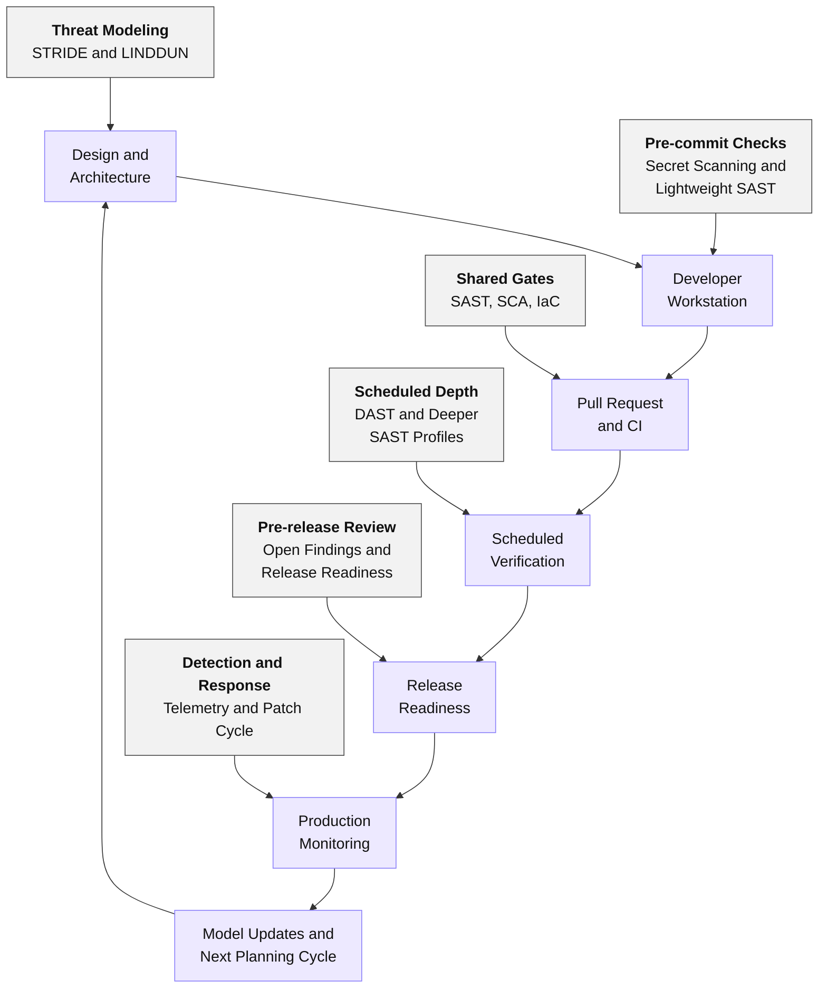
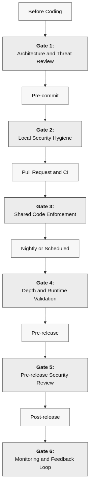
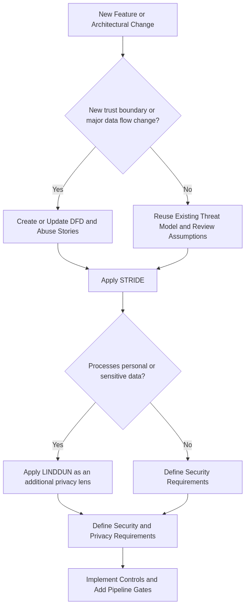
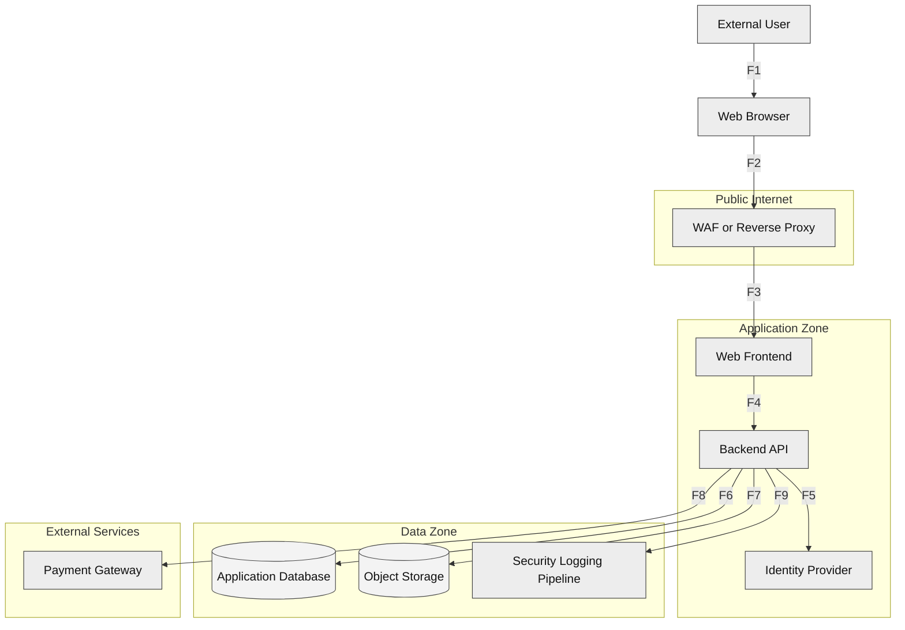
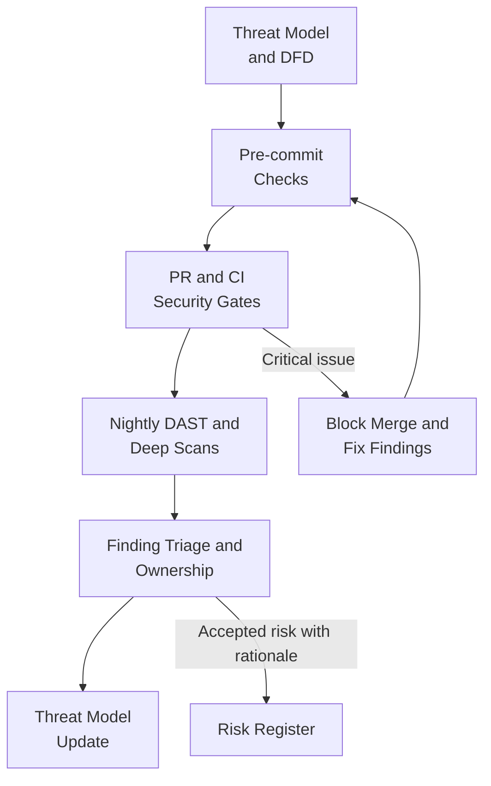
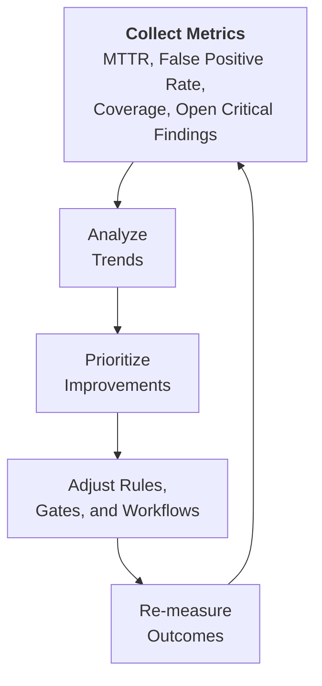

# DevSecOps Pipeline Blueprint

> A staged security approach that places the right controls at the right point in the delivery lifecycle.

## The Problem

Teams often adopt security tooling without deciding where each control adds the most value. The result is usually one of two failure modes:

- too many checks too early, which slows delivery and creates alert fatigue;
- too few meaningful checks until late stages, which increases remediation cost and leaves design flaws undiscovered.

An effective DevSecOps pipeline is not a collection of disconnected scanners. It is a decision system that connects design-time thinking, code-time guardrails, runtime validation, and post-release feedback.

## The Solution

### Overview

This blueprint recommends a layered pipeline in which fast, high-confidence checks run early and deeper validation runs later, when the environment and context make those checks more meaningful.



### Core Principle: Fast Feedback, Deeper Validation Later

| Stage | Goal | Best fit controls | Expected speed |
| --- | --- | --- | --- |
| Before coding | Find design flaws early | Threat modeling, abuse stories, security requirements | Workshop or review |
| Pre-commit | Stop obvious mistakes locally | Secret scanning, linting, lightweight SAST | Seconds |
| Pull request / CI | Enforce team standards | SAST, tests, SCA, IaC checks | Minutes |
| Nightly / scheduled | Run broader verification | DAST, deeper SAST profiles, container scans | Tens of minutes or more |
| Pre-release | Validate production readiness | Risk review, release gates, hardening checks | Human review + automation |
| Post-release | Detect regressions and exposure | Logging, alerting, runtime monitoring, patching | Continuous |

The guiding rule is simple:

- use local checks for speed;
- use CI checks for consistency;
- use scheduled scans for depth;
- use production telemetry for feedback.

## Implementation



### Step 1: Model Threats Before Automating Controls

Threat modeling is the highest-leverage stage because design mistakes can survive code review and testing if the architecture itself is flawed.

Recommended activities:

- create a lightweight data flow diagram for the feature or system;
- identify trust boundaries;
- apply STRIDE to reason about classic security threats;
- apply LINDDUN when the feature processes personal data or introduces privacy risk;
- define abuse stories alongside user stories;
- record security requirements before implementation begins.

Use STRIDE when you need a security-first lens:

- Spoofing for identity abuse;
- Tampering for integrity risks;
- Repudiation for missing accountability;
- Information Disclosure for confidentiality failures;
- Denial of Service for availability risks;
- Elevation of Privilege for broken authorization.

Use LINDDUN when privacy is central to the system:

- Linking;
- Identifying;
- Non-repudiation;
- Detecting;
- Data Disclosure;
- Unawareness;
- Non-compliance.

In practice, many systems benefit from both perspectives: STRIDE as the default security lens, and LINDDUN as an additional privacy lens when personal data is involved.





Questions worth asking before implementation starts:

- What data enters the system, and from whom?
- What are the trust boundaries?
- What can an attacker spoof, tamper with, disclose, or deny?
- What personal data could be linked, identified, detected, or disclosed?
- Which risks must be blocked before release, and which can be tracked with compensating controls?

### Step 2: Keep Pre-commit Controls Fast and Deterministic

Pre-commit checks should stop obvious mistakes without delaying normal development flow.

Good candidates for this stage:

- secret scanning;
- formatting and linting;
- lightweight SAST rules focused on high-confidence findings;
- policy checks for obviously unsafe patterns.

Examples of issues that belong here:

- hardcoded credentials;
- dangerous functions such as `eval` or shell execution with user input;
- accidental commits of `.env` files, keys, or certificates;
- dependency manifests that violate local security policy.

What does not belong here:

- long-running DAST scans;
- heavyweight full-repository scans on every commit;
- noisy checks that developers cannot resolve quickly.

### Step 3: Use Pull Requests and CI as Shared Security Gates

The pull request stage is the main enforcement point for shared code quality because it evaluates what the team is about to merge, not just an individual developer's workstation state.

Recommended controls:

- SAST with a team-approved ruleset;
- software composition analysis for dependency risk;
- infrastructure-as-code scanning when Terraform, Kubernetes, or cloud templates exist;
- test execution with security-relevant assertions;
- artifact generation for findings and triage history.

Good PR policy:

- block on high-confidence, high-severity issues;
- warn on medium-risk findings that need human triage;
- document accepted risk explicitly instead of silently ignoring alerts;
- maintain a baseline so the team focuses first on newly introduced risk.

### Step 4: Run Deeper Verification on a Schedule

Scheduled jobs are the right place for slower controls that need a realistic running environment.

Recommended controls:

- DAST against a deployed test environment;
- deeper SAST profiles that are too slow for every pull request;
- container image scanning;
- repository or history re-scans for secrets when policy allows it;
- configuration drift checks and hardening validation.

This stage is especially useful for:

- authenticated DAST scenarios;
- APIs with a broad attack surface;
- environments that depend on real routing, proxies, or deployed configuration;
- trend analysis over time.

### Step 5: Add an Explicit Pre-release Security Review

Before release, teams should confirm that open findings have been triaged and that remaining risk has an owner.

Recommended checks:

- no unreviewed critical findings;
- remediation plans for remaining high-risk issues;
- release notes include security-relevant changes;
- rollback paths exist;
- logging and alerting are active for sensitive operations.

### Step 6: Close the Loop After Release

A secure pipeline does not end at deployment. Post-release feedback should improve the next delivery cycle.

Recommended activities:

- vulnerability management and patch cadence;
- monitoring for suspicious authentication, authorization, and input abuse events;
- alerting on unexpected privilege use;
- dependency refresh planning;
- lessons learned fed back into threat models and coding rules.

## Code Examples

### Bad Practice (Vulnerable)

```yaml
name: monolithic-security-check

on:
  push:
    branches: ["*"]

jobs:
  security:
    runs-on: ubuntu-latest
    steps:
      - uses: actions/checkout@v4
      - run: semgrep ci
      - run: dependency-scanner --fail-on low
      - run: iac-scan ./infra --fail-on medium
      - run: zap-full-scan.py -t https://staging.example.com
      - run: container-scan registry.example/app:latest
```

**Why this is problematic:**

- Every control runs on every push, which creates slow feedback and developer friction.
- The pipeline blocks on low-value noise instead of focusing on high-confidence issues.
- DAST and deeper scans run too often and in the wrong place, making results harder to triage.
- There is no evidence of local checks, baselining, or separation between fast and deep validation.

### Good Practice (Secure)

```yaml
name: staged-security-gates

on:
  pull_request:
  schedule:
    - cron: "0 2 * * *"

jobs:
  pr-security-gates:
    if: github.event_name == 'pull_request'
    runs-on: ubuntu-latest
    steps:
      - uses: actions/checkout@v4
      - run: semgrep ci --config auto
      - run: dependency-scanner --fail-on high --baseline baseline.sarif
      - run: iac-scan ./infra --fail-on high

  scheduled-depth-scans:
    if: github.event_name == 'schedule'
    runs-on: ubuntu-latest
    steps:
      - uses: actions/checkout@v4
      - run: zap-automation.py -cmd -autorun zap-plan.yaml
      - run: container-scan registry.example/app:latest
```

**Why this works:**

- Fast, high-signal checks run in pull requests where merge decisions happen.
- Deeper runtime validation is moved to a schedule, where longer execution is acceptable.
- Severity thresholds and baselines reduce alert fatigue and focus attention on meaningful risk.
- The pipeline structure matches the staged model described in this best practice.

## Recommended Minimum Pipeline

For student projects, smaller teams, or organizations building security practices incrementally, the following baseline is a practical starting point:

1. Threat model each major feature with a simple DFD.
2. Apply STRIDE to security concerns and LINDDUN to privacy-sensitive data flows.
3. Run pre-commit hooks for secret detection, linting, and lightweight SAST.
4. Run pull request checks for SAST, dependency scanning, and tests.
5. Run DAST on a scheduled basis against a deployed test environment.
6. Track findings in issues with severity, owner, and remediation target date.
7. Revisit the threat model when architecture or trust boundaries change.



This baseline works well because it balances three constraints:

- developers get fast feedback;
- reviewers get enforceable quality gates;
- the team still performs runtime validation.

## Tooling Guidance

The exact tooling will vary by language, budget, and team maturity, but the selection criteria should stay stable. Prefer tools that:

- integrate cleanly with Git hooks and CI pipelines;
- produce machine-readable output for triage;
- support baselining or suppressions with traceability;
- allow targeted rule tuning instead of all-or-nothing adoption;
- have documentation that developers can realistically use.

Pragmatic examples:

- Semgrep for lightweight SAST in pre-commit and pull request stages;
- OWASP ZAP Automation Framework for repeatable DAST runs;
- dependency scanning in CI for third-party risk visibility;
- reusable threat modeling templates to make architecture review repeatable.

## Benefits

- Faster remediation because cheap-to-fix issues are caught early.
- Better signal-to-noise ratio because each control runs where it is most useful.
- Clearer ownership because findings are tied to pipeline stages and release decisions.
- Stronger feedback loops because production telemetry informs future design and coding practices.

## Common Pitfalls

- Treating security as a final testing phase.
- Blocking every pipeline stage with every scanner.
- Ignoring privacy threats because the team only models classic security abuse.
- Accepting false positives without documenting why they are false positives.
- Running DAST without authentication when the real application risk is behind login.
- Measuring success by number of tools instead of reduction of exploitable risk.
- Never updating threat models after major architecture changes.

## When to Apply

- **Always:** When building or maintaining a CI/CD pipeline for software that handles real users, data, or integrations.
- **Recommended:** When introducing SAST, DAST, SCA, or threat modeling for the first time and you need a sensible rollout plan.
- **Consider:** For prototypes and student projects, where a lighter version of the minimum pipeline is often enough to establish good habits early.

## Framework/Language-Specific Guidance

### pre-commit

Use local hooks for the fastest checks only:

```yaml
repos:
  - repo: https://github.com/gitleaks/gitleaks
    rev: v8.24.2
    hooks:
      - id: gitleaks
  - repo: https://github.com/semgrep/pre-commit
    rev: v1.117.0
    hooks:
      - id: semgrep
        args: ["--config", "auto"]
```

### GitHub Actions

Use pull requests for merge-blocking gates and schedules for depth scans:

```yaml
on:
  pull_request:
  schedule:
    - cron: "0 2 * * *"
```

### GitLab CI

Split fast checks from deeper scheduled validation:

```yaml
stages:
  - precheck
  - pr-gates
  - scheduled-depth

precheck:
  stage: precheck
  script:
    - gitleaks detect --no-git
    - semgrep --config auto .
```

## Verification & Testing

### Manual Checks

- Confirm that major features have a threat model or DFD before implementation begins.
- Confirm that merge-blocking rules are limited to high-confidence, high-severity findings.
- Confirm that accepted risk is documented rather than hidden in silent suppressions.
- Confirm that post-release monitoring exists for sensitive operations and exposed services.

### Automated Testing

```yaml
- name: Enforce pull request security gate
  run: |
    semgrep ci --config auto
    dependency-scanner --fail-on high --baseline baseline.sarif
    iac-scan ./infra --fail-on high
```

### Security Scanning

- **Secret scanning:** Gitleaks or TruffleHog can catch committed keys, tokens, and certificates early.
- **SAST:** Semgrep and similar tools can enforce high-confidence code and configuration rules.
- **SCA:** Dependency scanners can detect vulnerable or outdated third-party components.
- **IaC scanning:** IaC tools can catch risky cloud and Kubernetes misconfigurations before deployment.
- **DAST:** OWASP ZAP Automation Framework is a practical option for repeatable scheduled runtime testing.

### Metrics That Actually Matter

Avoid vanity metrics such as total alert volume. Prefer metrics that show whether the pipeline improves security outcomes:

- mean time to remediate high-severity findings;
- percentage of pull requests that introduce no new high-risk issues;
- false-positive rate for blocking rules;
- number of releases with unresolved critical findings;
- coverage of threat modeling for major features or services;
- number of authenticated DAST targets versus total exposed applications.



## Related Best Practices

- [Planning and Threat Modeling](../../01-Planning-and-Threat-Modeling/best-practices) - Complements this blueprint by improving early design-stage risk identification.
- [Static Analysis (SAST)](../../03-Static-Analysis-SAST/best-practices) - Supports the pull request and CI stages with code-level detection and policy enforcement.
- [Dynamic Analysis (DAST)](../../06-Dynamic-Analysis-DAST/best-practices) - Extends the scheduled verification stage with runtime validation against realistic environments.

## Standards & Compliance

- **OWASP Top 10:** Supports prevention across multiple categories by embedding checks before insecure code, dependencies, and configurations reach production.
- **CWE:** Helps reduce exposure to weakness classes such as hardcoded credentials, use of vulnerable components, and misconfigurations.
- **NIST SSDF (SP 800-218):** Closely aligned with secure development practices, verification activities, and release governance.
- **OWASP DevSecOps Guideline / SAMM / ASVS:** Useful references for pipeline maturity, control placement, and verification depth.
- **GDPR / PCI DSS / similar frameworks:** Privacy-aware threat modeling and auditability support compliance where regulated or sensitive data is involved.

## Further Reading

- [NIST Secure Software Development Framework (SSDF)](https://csrc.nist.gov/pubs/sp/800/218/final)
- [OWASP DevSecOps Guideline](https://owasp.org/www-project-devsecops-guideline/latest/)
- [OWASP SAMM](https://owasp.org/www-project-samm/)
- [OWASP Application Security Verification Standard (ASVS)](https://owasp.org/www-project-application-security-verification-standard/)
- [OWASP ZAP Automation Framework Documentation](https://www.zaproxy.org/docs/automate/automation-framework/)
- [Semgrep Documentation](https://semgrep.dev/docs/)
- [Microsoft STRIDE Threat Modeling Reference](https://learn.microsoft.com/en-us/azure/security/develop/threat-modeling-tool-threats)
- [LINDDUN Privacy Threat Modeling](https://linddun.org/)

## Case Studies

### Incident Example

The 2021 Codecov Bash Uploader compromise is a useful reminder that CI/CD tooling itself can become an attack path. A stronger pipeline security model would emphasize trusted tooling, restricted token scope, integrity verification, and monitoring for unexpected changes in build behavior.

### Success Story

Teams that separate fast pull request gates from deeper scheduled scans usually improve adoption and reduce alert fatigue. In practice, developers get quicker feedback on merge-blocking issues while security teams still retain broader runtime coverage and traceable triage.

## Acronym Glossary

| Acronym | Meaning |
| --- | --- |
| API | Application Programming Interface |
| AppSec | Application Security |
| ASVS | Application Security Verification Standard |
| CI | Continuous Integration |
| CI/CD | Continuous Integration and Continuous Delivery/Deployment |
| DAST | Dynamic Application Security Testing |
| DFD | Data Flow Diagram |
| DevSecOps | Development, Security, and Operations |
| IaC | Infrastructure as Code |
| LINDDUN | Linking, Identifying, Non-repudiation, Detecting, Data Disclosure, Unawareness, Non-compliance |
| MTTR | Mean Time To Remediate |
| PR | Pull Request |
| SAMM | Software Assurance Maturity Model |
| SAST | Static Application Security Testing |
| SCA | Software Composition Analysis |
| SDLC | Software Development Life Cycle |
| SSDLC | Secure Software Development Life Cycle |
| SSDF | Secure Software Development Framework |
| STRIDE | Spoofing, Tampering, Repudiation, Information Disclosure, Denial of Service, Elevation of Privilege |

## Tags

`devsecops` `ci-cd` `pipeline-security` `threat-modeling` `sast` `dast`

---

**Contributed by:** @luanacarolinareis
**Last Updated:** 2026-04-21
**Difficulty Level:** Intermediate
**Impact:** High
