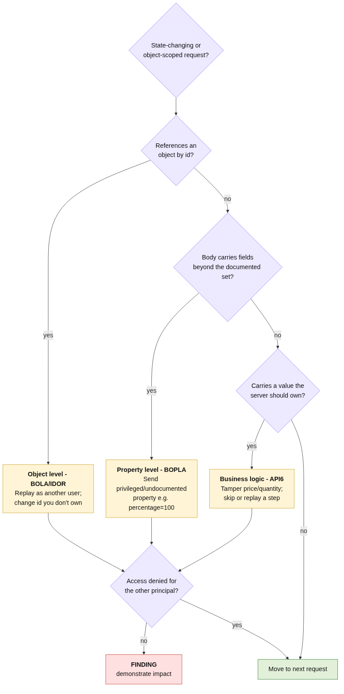

# Access Control & API Authorization Testing

> How to manually find the #1 web/API risk — broken object- and property-level authorization, and business-logic abuse — where every malicious request is a valid HTTP 200.

## The Problem

Broken access control is **OWASP A01:2021** (the top web risk) and supplies three of the OWASP API Security
Top 10 2023 entries: **API1 BOLA**, **API3 BOPLA / mass assignment**, and **API6 unrestricted access to
sensitive business flows**. It is also the class of bug automated scanners are worst at, because:

- there is no payload — `GET /my-account?id=carlos` is syntactically perfect;
- there is no error — the server returns `200 OK` with the data;
- the "vulnerability" is *semantic* — the request is only wrong because of *who* sent it or *what value* it
  carries, which a scanner has no way to judge.

So this is, definitively, a **manual** testing discipline. The reference series demonstrates all three sub-classes.

## The Solution

### Overview

Authentication answers *"who are you?"*; authorization answers *"may you do this to **this object**, with
**this property**?"*. Most access-control bugs are a developer conflating the two — checking that you are *a*
logged-in user, or have *a* role, but never that you own the specific object or may set the specific property.

Test authorization along three axes:

1. **Object level (BOLA/IDOR):** can you reach another user's object by changing an identifier?
2. **Property level (BOPLA/mass assignment):** can you read or write a property you have no authority over?
3. **Business flow (logic):** can you tamper a value the server should own, or skip/replay a step?



### Implementation

#### Step 1: Provision the test matrix
You need **two low-privilege accounts** (User A, User B) and, ideally, one privileged account. Object- and
property-level authorization can *only* be verified by replaying one principal's requests as another.

#### Step 2: Object-level testing (BOLA / IDOR)
For every request that references an object by id, replay it substituting an id you don't own.

```http
GET /my-account?id=carlos HTTP/1.1
Cookie: session=<User A's session>
```

In the reference lab this returns carlos's account page **and his API key** — horizontal escalation, full
account takeover, triggered by a one-character edit. Test horizontal (same privilege, different owner) *and*
vertical (low→high privilege) movement. Unpredictable identifiers (UUIDs) make enumeration harder but are not a
fix — always assume the id is guessable or leaked elsewhere.

#### Step 3: Property-level testing (BOPLA / mass assignment)
First **read the response** — it often advertises the field to attack. In the reference lab,
`GET /api/checkout` serialised the whole order object, leaking an undocumented `chosen_discount`:

```json
{"chosen_discount":{"percentage":0},"chosen_products":[{"product_id":"1","item_price":133700}]}
```

Then **echo the privileged property back** with a value you should not control:

```http
POST /api/checkout HTTP/1.1
Content-Type: application/json

{"chosen_discount":{"percentage":100},"chosen_products":[{"product_id":"1","item_price":133700}]}
```

The order is placed for free. This is the canonical **"GET feeds the POST"** chain: excessive data exposure on
the way out (API3's first half) makes mass assignment trivial on the way in (API3's second half). The deck's
textbook payload is `PUT /users/me {"isAdmin": true}`; here the same bug is a 100% discount.

#### Step 4: Business-flow / logic testing (API6)
Identify any security- or money-relevant value that is **sent by the client**, and lower/alter it. In the
reference lab the price travels client-side:

```http
POST /cart HTTP/1.1
Content-Type: application/x-www-form-urlencoded

productId=1&quantity=1&price=133700
```

Change `price=133700` to `price=1` and check out: a `$1337` jacket for `$0.01`, with **zero malicious
characters**. Also test multi-step flows for missing server-side consistency (skip a step, replay a step, send
a negative quantity).

#### Step 5: Demonstrate impact and automate
Capture the concrete impact (another user's secret, a free purchase, a privileged property set) and wrap the
manual steps in a PoC that re-tests the fix — see the
**[methodology](./web-application-penetration-testing-methodology.md#code-examples)**.

## Code Examples

### Bad Practice (the vulnerable server logic you are testing for)

```python
# Object lookup trusts a client-supplied id — BOLA.
@app.get("/my-account")
def my_account():
    return render(get_user(request.args["id"]))   # never checks ownership

# Checkout binds the whole body and trusts client price — mass assignment + logic.
order = Order(**request.json)                      # binds chosen_discount, price, ...
```

**Why this is problematic:**
- The `id` is attacker-controlled, so any user reads any account (BOLA).
- `Order(**request.json)` auto-binds every key, so a client sets `chosen_discount`/`isAdmin` (BOPLA).
- `price` is read from the client instead of the catalogue (business-logic abuse).

### Good Practice (what a passing re-test confirms)

```python
@app.get("/my-account")
def my_account():
    return render(get_user(session.user_id))       # identity derived server-side

@app.post("/api/checkout")
def checkout(body: CheckoutDTO):                   # explicit allow-list of writable fields
    price = catalogue.price_of(body.product_id)    # server owns the price
    apply_discount(only_if_authorized(session.user))
```

**Why this works:**
- The object is derived from the authenticated session, so there is no client id to tamper.
- A DTO binds only client-writable properties; `chosen_discount` can't be set from the request.
- Price (and discount authority) are recomputed server-side from trusted sources.

> Full remediation detail lives in
> **[Broken Access Control & API Authorization](../../02-Secure-Coding/best-practices/broken-access-control-and-api-authorization.md)**.

## Benefits

- **Targets the highest-impact, least-automatable class** — A01 + three API Top 10 entries.
- **Repeatable**: the two-account replay matrix makes coverage explicit and auditable.
- **Chains recon to exploit**: trains testers to read responses, where the attack is usually advertised.

## Common Pitfalls

1. **Single-account testing.** You cannot prove object/property authorization without a second principal.
2. **Trusting status codes.** A `200` is the *finding*, not the absence of one; a `403` on the happy path
   doesn't mean every sibling endpoint is guarded.
3. **Only testing writes.** Excessive data exposure on reads is what enables the write-side attack — inspect
   every response body.
4. **Assuming UUIDs == safe.** Unpredictable ids raise the bar but ids leak; ownership must still be enforced.
5. **Skipping negative/odd values in logic flows** (negative quantity, zero/over-100% discount, reordered steps).

## When to Apply

- **Always:** any multi-tenant app, any API exposing object ids, anything touching money or entitlements.
- **Recommended:** every release that changes access-control, checkout, or account-management code.
- **Consider:** automated authorization-regression tests generated from each finding.

## Framework/Language-Specific Guidance

### Python
```bash
# Two sessions, replay across them; assert you CANNOT read the other's object.
python3 poc.py https://target.example   # logs in as A, requests B's object, checks impact
```

### JavaScript/Node.js
```text
# Same matrix via Burp Repeater; watch JSON bodies for serialised internal objects
# (the leaked-field → mass-assignment chain is most common in JSON APIs).
```

### Tooling
```text
# Burp Suite: Repeater (replay across sessions), Intruder (id enumeration),
# match-and-replace rules to swap session cookies automatically while browsing.
```

## Verification & Testing

### Manual Checks
- Replay every object-scoped request as User B — is access denied?
- Diff documented request fields against the response body — any extra serialised fields?
- For each money/entitlement value, is it recomputed server-side regardless of what the client sends?

### Automated Testing
```python
def test_bola_enforced():
    r = user_a().get("/my-account", params={"id": user_b_id})
    assert r.status_code in (401, 403) or user_b_secret not in r.text

def test_mass_assignment_blocked():
    r = user_a().post("/api/checkout", json={"chosen_discount": {"percentage": 100}, **valid_order})
    assert charged_amount(r) == full_price        # privileged property ignored
```

### Security Scanning
Authorization is largely outside scanner reach; the durable control is the regression tests above plus the
**[secure-coding fixes](../../02-Secure-Coding/best-practices/broken-access-control-and-api-authorization.md)**.

## Related Best Practices

- [Web Application Penetration Testing Methodology](./web-application-penetration-testing-methodology.md)
- [Authentication & Identity Testing](./authentication-and-identity-testing.md)
- [Broken Access Control & API Authorization (defense)](../../02-Secure-Coding/best-practices/broken-access-control-and-api-authorization.md)

## Standards & Compliance

- **OWASP Top 10 2021:** A01:2021 Broken Access Control.
- **OWASP API Security Top 10 2023:** API1 BOLA, API3 BOPLA, API6 Sensitive Business Flows.
- **CWE:** CWE-639 (Authorization Bypass Through User-Controlled Key), CWE-915 (Mass Assignment), CWE-840 (Business Logic Errors).
- **OWASP WSTG:** Authorization Testing; Business Logic Testing.

## Further Reading

- [OWASP Authorization Cheat Sheet](https://cheatsheetseries.owasp.org/cheatsheets/Authorization_Cheat_Sheet.html)
- [OWASP Mass Assignment Cheat Sheet](https://cheatsheetseries.owasp.org/cheatsheets/Mass_Assignment_Cheat_Sheet.html)
- [OWASP API Security Top 10 2023](https://owasp.org/API-Security/editions/2023/en/0x11-t10/)
- [PortSwigger: Access control & IDOR](https://portswigger.net/web-security/access-control)

## Case Studies

### Incident Example
A one-character id swap returning another user's API key (reference BOLA lab) is the same shape as numerous
real breaches where authenticated mobile/web APIs let any user enumerate other accounts — the bug carries no
payload, so it routinely survives automated testing all the way to production.

### Success Story
The "GET feeds the POST" recon habit converts a hard-to-find write vulnerability into an obvious one: once a
tester reads `GET /api/checkout` and sees `chosen_discount`, the mass-assignment exploit writes itself —
turning careful reading into the entire exploit.

## Reference Labs

The techniques above are grounded in these PortSwigger Web Security Academy labs (solved as part of the
contributor's portfolio):

- [User ID controlled by request parameter](https://portswigger.net/web-security/access-control/lab-user-id-controlled-by-request-parameter) — object-level (IDOR / BOLA, API1:2023)
- [Exploiting a mass assignment vulnerability](https://portswigger.net/web-security/api-testing/lab-exploiting-mass-assignment-vulnerability) — property-level (BOPLA / mass assignment, API3:2023)
- [Excessive trust in client-side controls](https://portswigger.net/web-security/logic-flaws/examples/lab-logic-flaws-excessive-trust-in-client-side-controls) — business-flow abuse (API6:2023)

## Tags

`access-control` `idor` `bola` `bopla` `mass-assignment` `business-logic` `api-security` `authorization-testing` `owasp-api-top-10`

---

**Contributed by:** @roldao04
**Last Updated:** 2026-06-17
**Difficulty Level:** Intermediate
**Impact:** High
