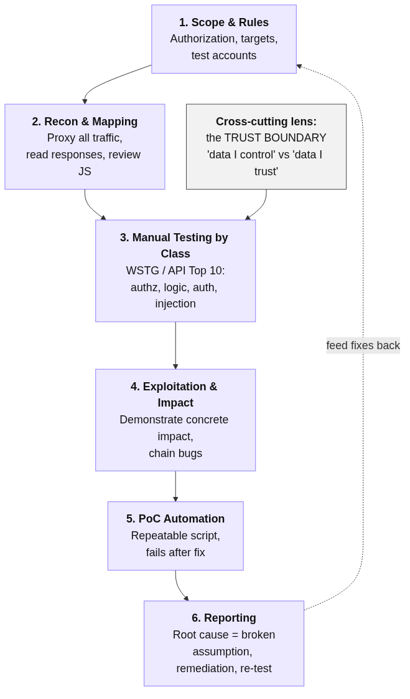
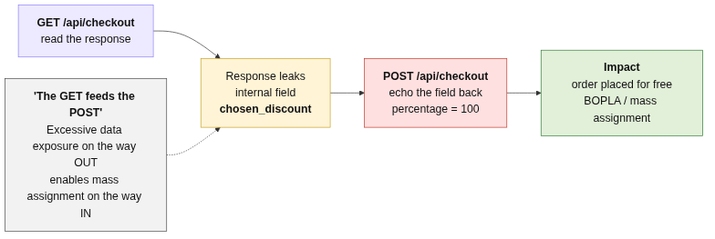

# Web Application Penetration Testing Methodology

> A repeatable, manual-first methodology for testing web applications — the human discipline that finds the bugs scanners can't.

## The Problem

Automated tooling — SAST in the IDE, DAST in CI, IAST at runtime — is necessary but not sufficient. A
whole class of high-impact web vulnerabilities is invisible to scanners because every malicious request is
*individually well-formed and returns HTTP 200*:

- **Access-control flaws** (IDOR/BOLA): changing `id=wiener` to `id=carlos` is a valid request — the server
  just shouldn't honour it. No payload, no error, nothing to pattern-match.
- **Business-logic flaws**: buying a `$1337` item for `$0.01` by editing a client-supplied `price` field is a
  clean transaction; only a human knows it's *wrong*.
- **Broken authentication / authorization at the "last inch"**: a backend that reads identity from a
  user-controlled `email` or `username` field next to an unverified credential.

If a CI/CD pipeline full of scanners would pass the application as clean, the only thing standing between the
flaw and production is a structured, manual penetration test. The risk of *not* having a methodology is that
testing becomes ad-hoc: testers poke at whatever they happen to notice, coverage is inconsistent, findings are
unrepeatable, and the subtle authorization/logic bugs — the ones that matter most — are exactly the ones
skipped.

> This methodology is grounded in a 10-lab PortSwigger Web Security Academy series covering SSRF, XXE, CSRF,
> DOM XSS via prototype pollution, JWT algorithm confusion, OAuth, IDOR/BOLA, business logic, mass assignment,
> and broken password reset. Each phase below cites the lab(s) that exercise it. It complements — does not
> replace — the automated **[DAST](../../06-Dynamic-Analysis-DAST)** and **fuzzing** practices in this chapter.

## The Solution

### Overview

Run every engagement through the same six phases, mapping coverage to the **[OWASP Web Security Testing Guide
(WSTG)](https://owasp.org/www-project-web-security-testing-guide/)** and the **[OWASP API Security Top
10 2023](../articles/owasp-api-security-top-10-2023.md)**. Manual testing finds the bug; an automated
proof-of-concept (PoC) makes it *repeatable and undeniable*; the report makes it *actionable*.

The single mental model that ties the whole methodology together is the **trust boundary**: every bug in the
reference series is the server trusting something it should have owned or verified — a client-supplied price, a
URL, an `alg` header, an `email` next to a token, a `username` next to a reset token. *Find where the
application draws the line between "data I control" and "data I trust," then push on it.*



### Implementation

#### Phase 1: Scope and rules of engagement
Define target hosts, in-scope functionality, allowed techniques, test accounts, and a destructive-action
policy *before* touching the application. Penetration testing without written authorization is illegal —
always operate inside an explicit scope (the labs run on PortSwigger's hosted infrastructure precisely so this
is safe and authorized).

#### Phase 2: Reconnaissance and mapping
Proxy all traffic through **[Burp Suite](../tools/burp-suite.md)** and walk every feature to populate the site
map. The goal is to enumerate the full request surface, including requests the UI never shows you:

- **Read every response carefully** — responses leak the attack. In the mass-assignment lab, `GET /api/checkout`
  serialised the *entire* internal order object, exposing an undocumented `chosen_discount` field that the
  documented request never mentioned. **The GET fed the POST.** Excessive data exposure on the way out is what
  makes the write-side attack trivial.

  

- **Review client-side JavaScript** — sources, sinks, and gadgets live here. The DOM-XSS lab was solved
  entirely by reading `searchLogger.js` and spotting that `config.transport_url` flowed into a `<script>` `src`.
- **Catalogue trust boundaries** — for each state-changing request, note which fields are *client-supplied* and
  which the server *should* derive itself (`price`, `id`, `email`, `alg`, reset tokens).

#### Phase 3: Manual testing by vulnerability class
Work the WSTG categories deliberately. The reference series maps as follows:

| WSTG / OWASP category | Technique | Reference lab |
|---|---|---|
| Authorization → object level | Change an object identifier you don't own (`id=wiener`→`id=carlos`) | IDOR/BOLA |
| Authorization → property level | Send an undocumented/privileged property (`chosen_discount.percentage=100`) | Mass assignment / BOPLA |
| Business logic | Tamper a value the server should own (`price`) | Excessive client-side trust |
| Authentication | Empty/forge a credential, swap the identity field beside it | Password reset, OAuth, JWT |
| Session management → CSRF | Re-express a state change as the unguarded verb (POST→GET), drop the token | CSRF method bypass |
| Injection → server-side | Coerce the server into a request/parse it shouldn't make | SSRF, XXE |
| Injection → client-side | Pollute a prototype, find a gadget that reaches a sink | DOM XSS + prototype pollution |

Two techniques deserve their own emphasis because no scanner performs them well:

- **Manual authorization testing.** With two accounts (or one account and a known second object id), replay
  every object-scoped request as the *other* user. Authorization is a per-object, per-property question that
  authentication cannot answer — a valid session proves *who you are*, never *what you may read*.
- **Trust-boundary substitution.** Wherever identity and proof travel as *separate* fields, change the identity
  and keep the proof: swap `email` while keeping a valid OAuth `token`; swap `username` while emptying the reset
  `token`; flip `alg` to `HS256` so the public key becomes the HMAC secret.

#### Phase 4: Exploitation and impact
Demonstrate concrete impact, not just the anomaly. "The endpoint accepts `id=carlos`" becomes "full horizontal
account takeover — here is another user's API key." Chain bugs where possible (the mass-assignment exploit is
a recon→write chain in a single click).

#### Phase 5: Proof-of-concept automation
Turn the working manual exploit into a small, dependency-light script so the finding is reproducible by anyone
and re-testable after the fix. The reference series uses Python 3 + `requests` with a shared helper library
(session handling, HTML/CSRF-token scraping, status polling) — see the pattern in **[Code Examples](#code-examples)**.

#### Phase 6: Reporting
For each finding record: title, severity/impact, affected request, reproduction steps (manual + PoC), the
*developer assumption that was broken*, remediation with standards references, and a re-test result. Framing the
root cause as a broken assumption ("the price displayed is the price we'll charge") is what makes a report
teach rather than merely list.

## Code Examples

### Bad Practice (Ad-hoc, unrepeatable testing)

```text
# Tester pokes around the live app by hand, finds something odd, screenshots it.
"I changed the id in the URL and it showed another account. Looks like IDOR?"
```

**Why this is problematic:**
- Not reproducible — the next person (or the developer verifying the fix) can't reliably reproduce it.
- No impact demonstrated — "looks like IDOR" is not "retrieved another user's API key."
- No coverage guarantee — what other object-scoped endpoints were *not* tested?

### Good Practice (Structured manual test + repeatable PoC)

```python
# A minimal, dependency-light PoC mirrors the manual finding and survives re-testing.
# (Pattern from the reference series; sanitized — no real lab IDs/keys.)
import sys, requests

def main(base):
    s = requests.Session()
    # 1. Authenticate as the low-privilege user (recon established the login flow).
    s.post(f"{base}/login", data=login_form(s, base))
    # 2. Manual finding, now automated: request an object we do not own.
    r = s.get(f"{base}/my-account", params={"id": "carlos"})
    # 3. Demonstrate IMPACT, not just the anomaly: extract the victim's secret.
    api_key = extract(r.text, r'API Key: (\w+)')
    assert api_key, "no key returned — authorization may be fixed"
    print(f"[+] Horizontal escalation confirmed; carlos API key: {api_key}")

if __name__ == "__main__":
    main(sys.argv[1].rstrip("/"))
```

**Why this works:**
- Reproducible and CI-friendly — the same script re-tests the fix and should *fail* once authorization is enforced.
- Asserts impact (a captured secret), giving the report undeniable evidence.
- Reads like a regression test: it documents both the attack and the expected secure behaviour.

## Benefits

- **Catches what automation misses:** authorization, business-logic, and "last-inch" auth bugs that SAST/DAST/IAST structurally cannot find.
- **Repeatable coverage:** mapping to WSTG/API Top 10 makes engagements consistent and auditable.
- **Actionable output:** PoC scripts double as regression tests; root-cause framing teaches developers.
- **Defence-in-depth feedback loop:** findings feed directly into secure-coding fixes (see **[Related Best Practices](#related-best-practices)**).

## Common Pitfalls

1. **Testing only with one account / one role.** Object- and property-level authorization can only be tested by
   replaying another principal's requests. Always provision at least two test users.
2. **Stopping at the anomaly.** "It returned 200" is not a finding; demonstrate impact.
3. **Ignoring responses.** The exploit is often handed to you in a response body (leaked fields, JS gadgets,
   error messages echoing input). Recon *is* the exploit more often than not.
4. **Block-list thinking.** Trying to enumerate "bad" inputs instead of reasoning about *who should own this
   value*. The bug is structural, not lexical.
5. **No re-test.** A finding without a PoC that fails-after-fix leaves verification to chance.

## When to Apply

- **Always:** before releasing any application that handles authentication, authorization, money, or PII;
  after significant changes to access-control or business-logic code.
- **Recommended:** as a periodic (e.g. per-release) complement to automated DAST in the pipeline.
- **Consider:** continuous, scoped manual testing (bug-bounty style) for high-value targets.

## Framework/Language-Specific Guidance

The methodology is language-agnostic; the *tooling* adapts:

### Python
```bash
# requests + a small helper module is enough for most HTTP-level PoCs.
pip install requests
python3 poc.py https://target.example
```

### JavaScript/Node.js
```text
# Client-side bugs (DOM XSS, prototype pollution) require a real JS engine.
# Use the browser + DevTools to confirm source→gadget→sink; `requests`-style
# clients cannot execute JS and can only confirm the gadget exists in the code.
```

### Any stack
```text
# Burp Suite sits in front of every stack as the intercepting proxy.
# Repeater for iteration, Intruder for enumeration, JWT Editor for token attacks.
```

## Verification & Testing

### Manual Checks
- Did every object-scoped endpoint get replayed as a second user? (authorization coverage)
- For every state-changing request, is each client-supplied field one the client is *allowed* to own?
- Were responses inspected for fields/gadgets absent from the documented request?

### Automated Testing
```python
# Convert each finding into a regression test that MUST fail once remediated.
def test_idor_is_fixed():
    r = victim_session().get("/my-account", params={"id": "someone-else"})
    assert "API Key" not in r.text  # passes only when object-level authz is enforced
```

### Security Scanning
Pair the manual methodology with automated coverage so each catches the other's blind spots:
- **[Burp Suite](../tools/burp-suite.md)** (manual-first, Pro adds an active scanner)
- **[OWASP ZAP](../../06-Dynamic-Analysis-DAST)** (automated DAST)
- Coverage-guided fuzzing for input-handling code (see this chapter's fuzzing entries)

## Related Best Practices

- [Access Control & API Authorization Testing](./access-control-and-api-authorization-testing.md) — the deep dive on the highest-value manual class.
- [Authentication & Identity Testing](./authentication-and-identity-testing.md) — JWT, OAuth, and reset-token trust-boundary attacks.
- [Broken Access Control & API Authorization (defense)](../../02-Secure-Coding/best-practices/broken-access-control-and-api-authorization.md) — how to *fix* what this methodology finds.
- [Preventing SSRF & Server-Side Request Abuse (defense)](../../02-Secure-Coding/best-practices/preventing-ssrf-and-server-side-request-abuse.md)

## Standards & Compliance

- **OWASP WSTG:** the canonical category checklist this methodology follows.
- **OWASP Top 10 2021:** A01 Broken Access Control, A03 Injection, A07 Identification & Authentication Failures, A10 SSRF.
- **OWASP API Security Top 10 2023:** API1 BOLA, API2 Broken Authentication, API3 BOPLA, API6 Business Flows, API7 SSRF.
- **NIST SP 800-115:** Technical Guide to Information Security Testing and Assessment.
- **PTES:** Penetration Testing Execution Standard (phase structure).

## Further Reading

- [OWASP Web Security Testing Guide](https://owasp.org/www-project-web-security-testing-guide/)
- [OWASP API Security Top 10 2023](https://owasp.org/API-Security/editions/2023/en/0x11-t10/)
- [PortSwigger Web Security Academy](https://portswigger.net/web-security)
- [NIST SP 800-115](https://csrc.nist.gov/pubs/sp/800/115/final)

## Case Studies

### Incident Example
The reference IDOR lab is a one-character edit (`wiener`→`carlos`) that returns another user's API key — full
horizontal account takeover. Real-world equivalents (e.g. mobile-banking and telco APIs enumerable by account
id) have repeatedly exposed millions of records for exactly this reason: authentication present, object-level
authorization absent.

### Success Story
Re-running the PoC scripts after remediation turns a penetration test into a regression suite: once the server
derives the user from the session (IDOR) and binds request bodies to a DTO allow-list (mass assignment), the
same scripts return 403/clean responses — providing objective, repeatable proof the fix holds.

## Reference Labs

This methodology is grounded in a 10-lab PortSwigger Web Security Academy series solved as part of the
contributor's portfolio — each phase and case study traces to one of these:

| PortSwigger lab | Vulnerability class |
|---|---|
| [Basic SSRF against the local server](https://portswigger.net/web-security/ssrf/lab-basic-ssrf-against-localhost) | SSRF (API7) |
| [Exploiting XXE using external entities to retrieve files](https://portswigger.net/web-security/xxe/lab-exploiting-xxe-to-retrieve-files) | XXE (A05) |
| [CSRF where token validation depends on request method](https://portswigger.net/web-security/csrf/bypassing-token-validation/lab-token-validation-depends-on-request-method) | CSRF |
| [DOM XSS via client-side prototype pollution](https://portswigger.net/web-security/prototype-pollution/client-side/lab-prototype-pollution-dom-xss-via-client-side-prototype-pollution) | DOM XSS + prototype pollution |
| [JWT authentication bypass via algorithm confusion](https://portswigger.net/web-security/jwt/algorithm-confusion/lab-jwt-authentication-bypass-via-algorithm-confusion) | JWT (API2) |
| [Authentication bypass via OAuth implicit flow](https://portswigger.net/web-security/oauth/lab-oauth-authentication-bypass-via-oauth-implicit-flow) | OAuth (API2) |
| [User ID controlled by request parameter](https://portswigger.net/web-security/access-control/lab-user-id-controlled-by-request-parameter) | IDOR / BOLA (API1) |
| [Excessive trust in client-side controls](https://portswigger.net/web-security/logic-flaws/examples/lab-logic-flaws-excessive-trust-in-client-side-controls) | Business logic (API6) |
| [Exploiting a mass assignment vulnerability](https://portswigger.net/web-security/api-testing/lab-exploiting-mass-assignment-vulnerability) | Mass assignment / BOPLA (API3) |
| [Password reset broken logic](https://portswigger.net/web-security/authentication/other-mechanisms/lab-password-reset-broken-logic) | Broken authentication (API2) |

## Tags

`penetration-testing` `manual-testing` `owasp-wstg` `owasp-api-top-10` `access-control` `business-logic` `methodology` `burp-suite`

---

**Contributed by:** @roldao04
**Last Updated:** 2026-06-17
**Difficulty Level:** Intermediate
**Impact:** High
