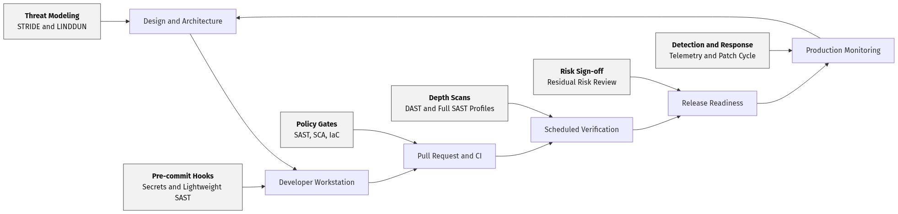
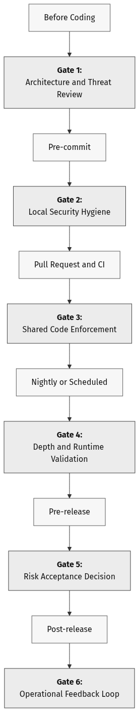
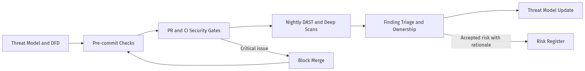
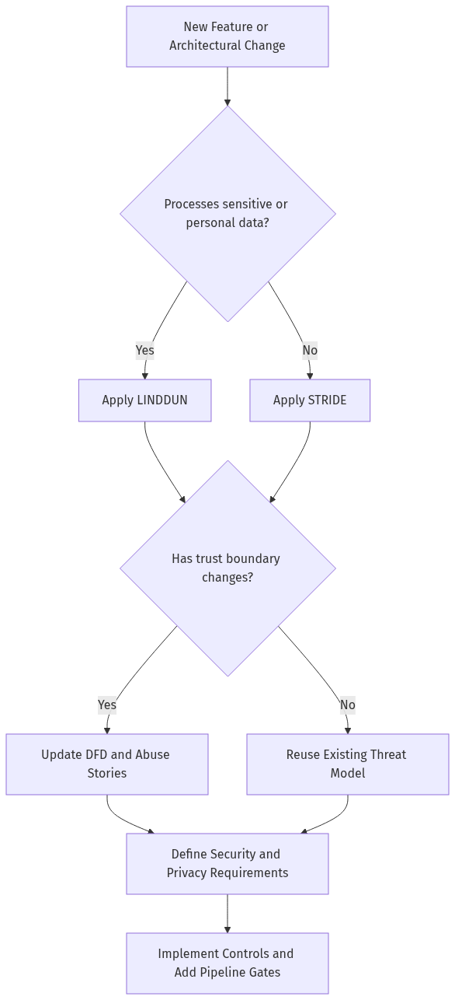
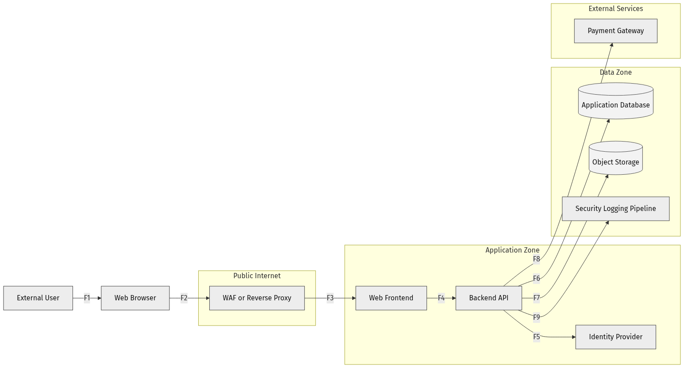
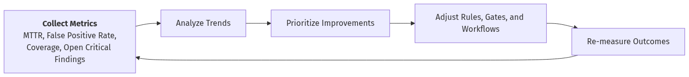

# DevSecOps Pipeline Blueprint

This contribution presents a structured blueprint for integrating AppSec and DevSecOps controls across the software delivery lifecycle. It addresses a recurrent problem in engineering practice: security controls are adopted, but frequently positioned at suboptimal stages of delivery, reducing effectiveness and increasing operational friction.

The objective is to provide a reusable reference that aligns security design, implementation safeguards, runtime validation, and post-release feedback.

## Table of Contents

1. [Why This Blueprint Matters](#why-this-blueprint-matters)
2. [Core Principle: Fast Feedback, Deeper Validation Later](#core-principle-fast-feedback-deeper-validation-later)
3. [Security Activities by Delivery Stage](#security-activities-by-delivery-stage)
4. [Recommended Minimum Pipeline](#recommended-minimum-pipeline)
5. [Threat Modeling Before Automation](#threat-modeling-before-automation)
6. [Tooling Guidance](#tooling-guidance)
7. [Common Anti-Patterns](#common-anti-patterns)
8. [Metrics That Actually Matter](#metrics-that-actually-matter)
9. [Acronym Glossary](#acronym-glossary)
10. [Conclusion](#conclusion)
11. [References](#references)

## Why This Blueprint Matters

Secure SDLC and DevSecOps initiatives are most effective when each control is placed at the appropriate stage of delivery. Applying every scanner at every stage tends to create friction, false-positive overload, and alert fatigue. Conversely, applying insufficient controls late in the lifecycle creates blind spots and increases remediation costs.

The practical objective is to:

- catch cheap-to-fix issues as early as possible;
- delay expensive or slower checks to stages where they add real signal;
- connect design-time thinking with code-time and runtime validation;
- make security part of delivery, not a separate ceremony.

## Core Principle: Fast Feedback, Deeper Validation Later

Not every security activity belongs in the same place.

| Stage | Goal | Best fit controls | Expected speed |
| --- | --- | --- | --- |
| Before coding | Find design flaws early | Threat modeling, abuse stories, security requirements | Workshop or review |
| Pre-commit | Stop obvious mistakes locally | Secret scanning, linting, lightweight SAST | Seconds |
| Pull request / CI | Enforce team standards | SAST, unit/integration tests, SCA, IaC checks | Minutes |
| Nightly / scheduled | Run broader verification | Full SAST profiles, DAST, container scans, baseline drift checks | Tens of minutes or more |
| Pre-release | Validate production readiness | Risk review, release gates, hardening checks, targeted pentest evidence | Human review + automation |
| Post-release | Detect regressions and exposure | Logging, alerting, runtime monitoring, patch management | Continuous |

### Diagram: Delivery Security Control Map

The operating principle is:

- use local checks for speed;
- use CI checks for consistency;
- use scheduled scans for depth;
- use production telemetry for feedback.

## Security Activities by Delivery Stage

### Diagram: Stage-to-Gate View

### Before Coding

This is the highest-leverage phase. An incorrect trust boundary or unsafe data flow may persist through multiple code reviews if architectural assumptions are flawed.

Recommended activities:

- create a lightweight data flow diagram of the system or feature;
- apply STRIDE to identify security threats across trust boundaries;
- apply LINDDUN when the feature processes personal data or creates privacy risk;
- define abuse stories alongside user stories;
- record security requirements before implementation starts.

Questions worth asking:

- What data enters the system, and from whom?
- What are the trust boundaries?
- What can an attacker tamper with, spoof, disclose, or deny?
- What personal data could be linked, identified, detected, or disclosed?
- Which risks must be blocked before release, and which can be tracked with compensating controls?

### Pre-commit

Pre-commit controls should be fast, deterministic, and consistently enforceable.

Good candidates:

- secret scanning;
- formatting and linting;
- lightweight SAST rules focused on high-confidence findings;
- policy checks for obviously unsafe patterns.

Examples of issues that belong here:

- hardcoded credentials;
- direct use of dangerous functions such as `eval` or shell execution with user input;
- insecure dependency manifests that violate local policy;
- accidental commits of API keys, certificates, or `.env` files.

What does not belong here:

- long-running DAST scans;
- heavyweight full-repository scans that slow down every commit;
- controls with high false-positive rates that developers cannot resolve quickly.

### Pull Request / CI

The pull request stage is a primary enforcement point because it evaluates shared code rather than local developer state.

Recommended controls:

- SAST with a team-approved ruleset;
- software composition analysis for vulnerable dependencies;
- infrastructure-as-code scanning when Terraform, Kubernetes, or cloud templates exist;
- test execution with security-relevant assertions;
- artifact generation for findings and triage history.

Good PR policy:

- block on high-confidence, high-severity issues;
- warn on medium-risk findings that require human triage;
- document accepted risk explicitly instead of silently ignoring alerts;
- keep a baseline so the team focuses on newly introduced risk first.

### Nightly or Scheduled Scans

Scheduled jobs are suitable for depth and breadth of analysis.

Recommended controls:

- DAST against a running environment;
- deeper SAST profiles that would be too slow for every PR;
- container image scanning;
- secrets re-scans across repository history if policy allows it;
- configuration drift checks and platform hardening validation.

This stage is especially useful for:

- authenticated DAST scenarios;
- APIs with large attack surfaces;
- workflows that depend on real routing, proxies, or deployed configuration;
- trend analysis over time.

### Pre-release

Before release, teams should verify that open findings have been triaged and that known risks have explicit ownership.

Recommended checks:

- no unreviewed critical findings;
- remediation plan for remaining high issues;
- release notes include security-relevant changes;
- emergency rollback path exists;
- logging and alerting are active for sensitive operations.

### Post-release

A pipeline is incomplete if it ends at deployment.

Security feedback after release should include:

- vulnerability management and patch cadence;
- monitoring for suspicious authentication, authorization, and input abuse events;
- alerting on unexpected privilege use;
- dependency refresh planning;
- lessons learned fed back into threat models and coding rules.

## Recommended Minimum Pipeline

For student projects, early-stage teams, or small product organizations, the following baseline is typically sufficient to establish meaningful security coverage without disrupting delivery cadence:

1. Threat model each major feature with a simple DFD.
2. Apply STRIDE to security concerns and LINDDUN to privacy-sensitive data flows.
3. Run pre-commit hooks for secrets detection, linting, and lightweight SAST.
4. Run PR checks for SAST, dependency scanning, and tests.
5. Run DAST on a scheduled basis against a deployed test environment.
6. Track findings in issues with severity, owner, and target remediation date.
7. Revisit the threat model when architecture or trust boundaries change.

This baseline works because it balances three constraints:

- developers get fast feedback;
- reviewers get enforceable quality gates;
- the team still performs runtime validation.

### Diagram: Minimum Pipeline Execution Flow

## Threat Modeling Before Automation

Automation is essential, but it is downstream from design decisions. Scanners can detect unsafe code patterns, but they cannot reliably determine whether an architecture exposes inappropriate data flows or trust relationships.

Use STRIDE when you need a security-first lens:

- Spoofing for identity abuse;
- Tampering for integrity risks;
- Repudiation for missing accountability;
- Information Disclosure for confidentiality failures;
- Denial of Service for availability risks;
- Elevation of Privilege for broken authorization.

Use LINDDUN when privacy is central to the feature:

- Linking;
- Identifying;
- Non-repudiation;
- Detecting;
- Data Disclosure;
- Unawareness;
- Non-compliance.

In practice, many systems require both perspectives. A healthcare portal, fintech platform, university service, or SaaS product may withstand classic attack categories while still failing privacy-by-design principles.

### Diagram: STRIDE and LINDDUN Decision Path

### Diagram: Example Web Application DFD (with Trust Boundaries)

#### DFD Flow Index (for Threat Review Sessions)

- F1: External user interaction with browser client.
- F2: Browser-to-edge traffic entering the public trust boundary.
- F3: Edge-to-frontend traffic entering the application zone.
- F4: Frontend-to-backend API business flow.
- F5: API-to-identity provider authentication and token operations.
- F6: API-to-database structured data operations.
- F7: API-to-object storage file/blob operations.
- F8: API-to-payment gateway third-party transaction flow.
- F9: API-to-security logging and monitoring telemetry flow.

### DFD Threat Elicitation Hotspots

- F2-F3: Evaluate spoofing and tampering exposure at entry points across trust boundaries.
- F5: Evaluate authentication abuse, session integrity, and token leakage risk.
- F6-F7: Evaluate injection, excessive data access, and confidentiality risks.
- F8: Evaluate repudiation, error handling strategy, and third-party trust assumptions.
- F9: Evaluate data minimization, retention limits, and privacy disclosure concerns.

## Tooling Guidance

The exact toolchain depends on language stack, budget, and team maturity; however, selection criteria should remain stable.

Choose tools that:

- integrate cleanly with Git hooks and CI pipelines;
- produce machine-readable output for triage;
- support suppression or baselining with traceability;
- allow targeted rule tuning instead of all-or-nothing adoption;
- have documentation that developers can realistically use.

Pragmatic examples:

- use Semgrep or equivalent for quick SAST feedback in pre-commit and PR stages;
- use OWASP ZAP Automation Framework for repeatable DAST runs;
- use dependency scanning in CI for third-party risk visibility;
- use threat modeling templates so architecture review is repeatable, not improvised.

## Common Anti-Patterns

- Treating security as a final testing phase.
- Blocking every pipeline stage with every scanner.
- Ignoring privacy threats because the team only models classic security abuse.
- Accepting false positives without documenting why they are false positives.
- Running DAST without authentication when the real application risk is behind login.
- Measuring success by number of tools instead of reduction of exploitable risk.
- Never updating threat models after major architecture changes.

## Metrics That Actually Matter

Avoid vanity metrics such as total alert volume.

Prefer metrics that show whether the pipeline improves security outcomes:

- mean time to remediate high-severity findings;
- percentage of new pull requests that introduce no new high-risk issues;
- false-positive rate for blocking rules;
- number of releases with unresolved critical findings;
- coverage of threat modeling for major features or services;
- number of authenticated DAST targets versus total exposed applications.

The most useful metric is not the noisiest one; it is the one that supports clear prioritization of the next improvement cycle.

### Diagram: Metrics Improvement Feedback Loop

## Acronym Glossary

| Acronym | Meaning |
| --- | --- |
| API | Application Programming Interface |
| AppSec | Application Security |
| ASVS | Application Security Verification Standard (OWASP) |
| CI | Continuous Integration |
| CI/CD | Continuous Integration and Continuous Delivery/Deployment |
| DAST | Dynamic Application Security Testing |
| DFD | Data Flow Diagram |
| DevSecOps | Development, Security, and Operations |
| IaC | Infrastructure as Code |
| LINDDUN | Linking, Identifying, Non-repudiation, Detecting, Data Disclosure, Unawareness, Non-compliance |
| MTTR | Mean Time To Remediate |
| PETs | Privacy-Enhancing Technologies |
| PR | Pull Request |
| SAMM | Software Assurance Maturity Model (OWASP) |
| SAST | Static Application Security Testing |
| SCA | Software Composition Analysis |
| SDLC | Software Development Life Cycle |
| SSDLC | Secure Software Development Life Cycle |
| SSDF | Secure Software Development Framework (NIST SP 800-218) |
| STRIDE | Spoofing, Tampering, Repudiation, Information Disclosure, Denial of Service, Elevation of Privilege |
| WAF | Web Application Firewall |

## Conclusion

An effective DevSecOps pipeline is not a collection of disconnected scanners; it is a staged decision system.

Threat modeling enables teams to identify critical design risks before implementation. SAST reduces unsafe coding patterns prior to merge. DAST validates runtime behavior under adversarial conditions. Monitoring closes the loop after deployment. When these controls are placed deliberately, teams can improve both delivery reliability and security outcomes.

## References

1. NIST Secure Software Development Framework (SSDF), SP 800-218: https://csrc.nist.gov/pubs/sp/800/218/final
2. OWASP DevSecOps Guideline: https://owasp.org/www-project-devsecops-guideline/latest/
3. OWASP SAMM: https://owasp.org/www-project-samm/
4. OWASP Application Security Verification Standard (ASVS): https://owasp.org/www-project-application-security-verification-standard/
5. OWASP ZAP Automation Framework Documentation: https://www.zaproxy.org/docs/automate/automation-framework/
6. Semgrep Documentation: https://semgrep.dev/docs/
7. Microsoft STRIDE Threat Modeling Reference: https://learn.microsoft.com/en-us/azure/security/develop/threat-modeling-tool-threats
8. LINDDUN Privacy Threat Modeling: https://linddun.org/